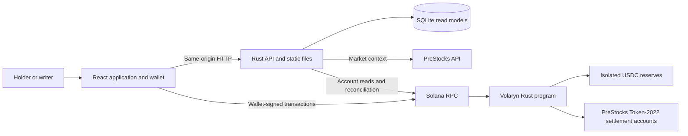
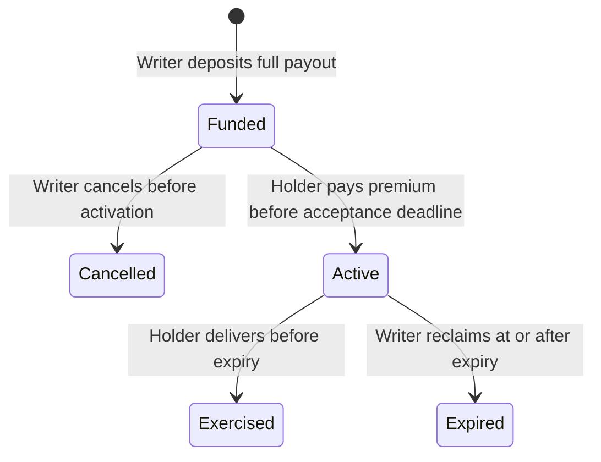

# Volaryn Architecture

**Status:** target architecture; application code and deployment files are not implemented.  
**Evidence reviewed:** 19 September 2026.

This document defines the system's responsibilities, financial rules, integrations, and deployment contract. The [README](../README.md) introduces the product. Paths, APIs, and commands below specify the intended implementation.

## 1. Design constraints

Volaryn connects a PreStocks holder seeking temporary downside protection with a writer willing to acquire that position under agreed terms. The holder keeps the underlying until exercise; the writer commits the entire USDC payout before activation.

| Requirement | Architectural consequence |
| --- | --- |
| A concrete holder problem | Position discovery and protection are the primary workflow. |
| A complete, demonstrable outcome | Funding, activation, independent exercise, and unused-expiry recovery use the actual Solana program. |
| A reason to use Solana | Program-controlled collateral and atomic settlement enforce the agreement. |
| Execution quality | Exact asset identity, visible funding, explicit transaction status, and failure-safe transfers are core behavior. |
| Meaningful PreStocks integration | Official mints, market context, token mechanics, and asset lifecycle determine eligibility and presentation. Competing pre-IPO issuers are excluded. |
| Simple operation | One Rust application process, a bundled React frontend, SQLite, and a reproducible Compose entry point. |

The first five requirements reflect the [Stocklana brief and sponsor criteria](https://hackathons.solana.com/hackathons/stocklana). Submission schedules and prize administration belong outside this architecture.

The financial scope is one funded offer for one exact asset quantity, one holder, and one full exercise. There is no pooled collateral, margin, liquidation engine, secondary options token, automated market maker, or reserve investment. A funded offer is executable inventory; a price estimate is not.

## 2. System shape and dependencies

Use a **modular monolith** for the application and a separate **on-chain settlement program**. Application modules share one process and database; the chain is the authority for financial rights.



The browser's normal RPC transport is a restricted same-origin backend proxy. The diagram separates transaction authorship from transport: the wallet signs, the backend forwards, and the program decides. An independently hosted client can submit the same instructions through another RPC.

| Area | Selected dependencies | Purpose |
| --- | --- | --- |
| Backend | Rust, Tokio, Axum, `tower-http` | Async HTTP, static frontend delivery, request limits, and tracing middleware. |
| External access | `reqwest` with Rustls; compatible Solana Rust client/types | PreStocks HTTP and typed chain access without a separate integration service. |
| Persistence | SQLite through SQLx, SQLite features only | Durable caches and query projections; no database container or ORM layer. |
| Data and errors | Serde, `thiserror`, `tracing`; decimal arithmetic for market values | Typed boundaries, stable errors, structured logs, and explicit numeric handling. |
| Program | Rust, Anchor, `anchor-spl`, Token-2022 interfaces | Account constraints, PDA authority, and extension-aware token operations. |
| Frontend | React, TypeScript, Vite, CSS | A static application with feature modules; no server-side rendering service. |
| Wallet and transactions | Solana Kit, its Wallet Standard plugin, React bindings, generated program client | Wallet discovery, account decoding, signing, and submission. |
| Build-time contracts | Anchor IDL, Codama; OpenAPI from Rust DTOs and generated TypeScript types | Keep program and HTTP clients aligned with their authoritative definitions. |
| Verification | Rust tests, LiteSVM, Vitest, Playwright | Financial invariants, adapter behavior, and complete browser flows. |

[Axum](https://docs.rs/axum/latest/axum/), [static file serving](https://docs.rs/tower-http/latest/tower_http/services/struct.ServeDir.html), and [SQLx](https://docs.rs/sqlx/latest/sqlx/) cover the application runtime without extra services. Use native React state and typed HTTP helpers; introduce no global state framework just to mirror server data.

[Solana recommends Kit for new frontends](https://solana.com/docs/frontend). Generate a Kit-compatible client from Anchor's IDL using [Codama](https://github.com/codama-idl/codama) and its [JavaScript renderer](https://github.com/codama-idl/renderers-js). Do not combine that client with Anchor's legacy TypeScript runtime, whose [documented compatibility](https://www.anchor-lang.com/docs/clients/typescript) is with `web3.js` v1. Pin a tested toolchain combination, Cargo/npm lockfiles, and container images; upgrades must pass serialization and transaction compatibility checks.

### Repository layout

```text
volaryn/
├── Cargo.toml                 # Rust workspace: backend, program, local tooling
├── Cargo.lock
├── rust-toolchain.toml
├── Anchor.toml
├── backend/
│   ├── src/{http,application,domain,adapters,jobs}/
│   └── migrations/
├── frontend/
│   └── src/{app,features,components,lib}/
├── programs/volaryn/src/      # Instructions, accounts, token rules, errors
├── packages/protocol/         # Generated IDL and TypeScript program client
├── config/                    # Network manifests and reviewed asset policies
├── tools/localnet/            # Validator bootstrap and disposable fixtures
├── tests/                     # Program scenarios and browser flows
├── package.json               # npm workspace and build scripts
├── package-lock.json
├── Dockerfile                 # Application, local tooling, and build targets
├── compose.yaml               # Self-contained local demonstration
├── compose.live.yaml          # Application connected to an existing deployment
├── README.md
└── docs/architecture.md
```

`http` validates transport input and calls `application`; application services coordinate domain rules and adapter interfaces. `domain` has no HTTP, database, or SDK dependency. Adapters implement chain reads, asset context, and persistence. Jobs call the same services as request handlers. Define interfaces at those external boundaries, not one interface per class or table.

The program owns settlement validation independently of backend checks. Frontend features cover positions, offers, protection, and writer commitments; shared components contain presentation rather than financial rules. Generated files are never hand-edited. The workspace build regenerates them and checks for drift.

## 3. Sources of truth and integrations

| Information | Authority |
| --- | --- |
| Agreement terms, holder, status, reserve, settlement | Solana program and token accounts |
| Wallet inventory and transfer capabilities | Token accounts, mint state, and their owning token programs |
| PreStocks identity and market context | Official PreStocks data, checked against reviewed mint admission |
| Supported assets and permitted new expiries | Versioned asset policy, with critical limits enforced on chain |
| Search results and dashboards | Rebuildable SQLite projections |
| Pending transaction feedback | Browser transaction state, reconciled against chain confirmation |

### PreStocks

The backend calls [`GET https://prestocks.com/api/prestocks`](https://prestocks.com/api/prestocks). An unauthenticated request succeeded during research. The observed response includes `contract_address`, `name`, `symbol`, `tokenPrice`, `markPrice`, `impliedValuation`, `markValuation`, and `supply`. No API key is required by the observed interface; no documented authentication or service-level guarantee is assumed.

Normalize this response through a typed adapter with bounded timeouts, retries, schema validation, and caching. Join assets by exact mint and network, never by ticker. API additions do not automatically become tradable. Preserve source provenance and `received_at`; the response does not provide a market observation timestamp, so receipt time must not be labelled price time. Missing values remain unavailable rather than becoming zero.

Wallet discovery uses [`getTokenAccountsByOwner`](https://solana.com/docs/rpc/http/gettokenaccountsbyowner) for Token-2022 holdings and the applicable USDC token program. Read mint state for decimals, extensions, and authorities. Aggregate holdings for display while retaining individual account identities and spendable balances.

**Verified compatibility finding:** a mainnet `getMultipleAccounts` inspection at finalized slot `448268396`, epoch `1037`, found all eight API-listed mints owned by Token-2022, with nine decimals. Their extensions included transfer fees, scaled UI amounts, permanent delegates, pausing, mutable freeze authority, confidential-transfer configuration, and a transfer-hook configuration whose program was unset. The active transfer fee was 50 basis points. These are dated observations, not constants to hardcode. Reproduce them using the official API's mint list and [Solana's account RPC](https://solana.com/docs/rpc/http/getmultipleaccounts).

### Quantity and issuer transfer rules

The agreement fixes **`quantity_raw`: the gross base-unit debit from the holder**, not a display balance or a guaranteed net writer receipt. The writer accepts the issuer's transfer-fee exposure. During exercise the holder transfers exactly this amount and receives the entire agreed USDC payout; issuer fees reduce the underlying credited to the settlement account. The program records the actual spendable credit. No additional holder quantity or writer approval is requested when a fee changes. This follows Token-2022's [transfer-fee semantics](https://solana.com/docs/tokens/extensions/transfer-fees).

Before signing, both parties see the gross quantity, estimated issuer fee, estimated net receipt, fixed USDC payout, premium, and expiry. A funded offer stores the gross-quantity interpretation explicitly. The platform fee is zero in this design; network fees and account rent are separate and never deducted from the payout.

[Scaled UI amounts](https://solana.com/docs/tokens/extensions/scaled-ui-amount) affect presentation, not raw balances. Use the token program's conversion semantics for human input, show the resolved raw obligation on review, and keep it immutable. A multiplier change can change the displayed quantity but cannot rewrite the agreement. Market-value calculations require a verified match between the API price unit and displayed token unit; otherwise show the source values separately and disable derived percentage/valuation presets.

Support ordinary transparent transfers for reviewed Token-2022 extension combinations. Mint-level confidential-transfer configuration is not a promise to support confidential balances. Unknown extensions or an active, unreviewed transfer hook prevent new admission; unsupported issuer changes can also make an existing transfer fail atomically. Do not accept arbitrary hook programs or additional CPI accounts.

### Asset policy and lifecycle

A reviewed policy binds network, mint, token program, decimals, supported extension behavior, official source, review date, review-validity deadline, admission status, and maximum expiry. The on-chain `AssetPolicy` enforces enablement, review validity, and expiry limits at offer creation and activation. The richer evidence stays in versioned configuration. Administrative policy transactions are signed outside the application process.

Lifecycle information is absent from the observed API and requires reviewed official notices. For example, the [SPACEX notice](https://prestocks.com/spacex) specifies a conversion deadline of 12 March 2027 at 23:59 UTC, and the [XAI notice](https://prestocks.com/xai) specifies 12 September 2026 at 23:59 UTC. Set maximum protection expiry strictly before any applicable conversion deadline, with an explicit reviewed buffer. Missing or outdated policy blocks new agreements.

Recheck policy at activation. Subsequent policy changes can stop new commitments but cannot change an active agreement's mint, quantity, payout, or expiry, or introduce an administrative exercise veto. Display new lifecycle warnings on active protection. There is no automatic migration into a replacement mint.

### Optional Pyth context

Pyth is an optional market-context adapter, absent from the core runtime dependency graph. Its data may support a meaningful comparison or writer decision, but never authorizes exercise or determines payout.

The [official pre-IPO announcement](https://www.pyth.network/blog/anthropic-openai-pre-ipo-feeds-on-pyth) identifies OpenAI and Anthropic indicators as **Pyth Indices**, with commercial terms separate from Pyth Pro. Do not assume a public Hermes feed, a Pyth Pro entitlement, or a directly comparable PreStocks token price. API access, units, provenance, and usage rights must be confirmed before implementing that adapter. There is no mandatory Pyth package, credential, or environment variable.

## 4. On-chain agreement

Use one Anchor program. Each agreement has its own reserve; funds cannot back multiple agreements.

| Account | Responsibility |
| --- | --- |
| `ProtocolConfig` | Deployment identity, exact USDC mint/program, and policy authority. Settlement identity is immutable for a deployment. |
| `AssetPolicy` | Admit a specific underlying and constrain new agreements. |
| `Agreement` PDA | Writer, unique nonce, optional designated holder, activated holder, exact mints/programs, raw quantity, payout, premium, acceptance deadline, expiry, policy version, timestamps, and state. |
| Reserve token account | Holds at least the promised USDC payout; the agreement PDA controls spending. |
| Underlying settlement token account | Receives the exercised underlying; controlled by the PDA until atomic handoff to the writer. |

Agreement addresses derive from a fixed seed, writer address, and unique nonce. Retain terminal agreement records to prevent reuse and permit account-based reconstruction. Validate account ownership, PDA seeds, signers, mint identities, token programs, and authorities using [Anchor constraints](https://www.anchor-lang.com/docs/references/account-constraints).

### State machine



An unaccepted offer becomes unavailable at its acceptance deadline; the writer can cancel and recover its reserve. For active agreements, expiry is effective by chain time even before a reclaim transaction changes the stored state. There is no scheduler required for correctness.

### Funding and activation

`create_offer` requires the writer's signature, valid policy, positive quantity and payout, and `now < accept_before <= expires_at`. It initializes the agreement and both token accounts, then deposits the entire payout. The writer pays account rent. The offer becomes funded only when all operations succeed.

Offers can be addressed to a holder; an unrestricted offer can be accepted once by any eligible signing holder. `activate` verifies the designated holder when present, current policy, deadline, and reserve. It atomically pays the fixed premium from holder to writer and records `Active`. The underlying remains with the holder. A cancellation and activation racing on the same account cannot both succeed.

### Independent exercise

`exercise` requires the recorded holder's signature, `Active`, and `Clock.unix_timestamp < expires_at`. In one atomic instruction it:

1. Validates the fixed account identities, reserve, and holder's spendable source balance.
2. Transfers `quantity_raw` to the predefined underlying settlement account using the admitted token behavior, and measures the credited amount.
3. Pays the exact reserved USDC amount to a holder-owned account.
4. Transfers ownership authority of the underlying settlement account to the immutable writer and records `Exercised` and the net credit.

Any failure rolls back every transfer and state change. There is no price threshold, oracle read, fresh writer signature, backend authorization, or mutable admission-policy check in this path.

The settlement account is a **custom token account, not an associated token account**. Allocate it for the actual mint-required extensions and initialize it without `ImmutableOwner` or `CpiGuard`, with no delegate and no separate close authority. This permits the PDA to hand token-account authority to the recorded writer through Token-2022 `SetAuthority`; its runtime owner remains Token-2022. The writer cannot modify the destination before exercise. Handoff gives the writer control of the received balance without a second mandatory token transfer; later consolidation may incur an issuer fee. This design follows the [official authority implementation](https://github.com/solana-program/token-2022/blob/bb07b98567d5519e4cfcfdd05e9a0b283f6c0cae/program/src/processor.rs#L709) and [immutable-owner rules](https://solana.com/docs/tokens/extensions/immutable-owner); compatibility tests against the pinned program are still required.

The client must discover this non-associated writer account. Exercise accepts one holder-owned source account containing the required spendable raw quantity. If holdings are split, the UI explains any consolidation and its transfer fees before asking for approval; it never silently changes the contractual quantity.

### Expiry, refunds, and account cleanup

At `now >= expires_at`, exercise is rejected and `reclaim_expired` allows the writer to recover USDC and records `Expired`. `cancel_offer` only applies to `Funded`. Both return funds to verified writer-owned accounts. Active collateral cannot be withdrawn, lent, or used to pay platform expenses.

Use `reserve >= payout`, not strict equality: unsolicited transfers must not break a valid agreement. Measure underlying delivery by the balance delta, not the settlement account's total. A writer-signed `cleanup_terminal` instruction, available only after a terminal transition, recovers USDC surplus to the writer and can hand over any still-PDA-controlled underlying account instead of requiring it to be empty. After exercise the writer already controls that account. Rent recovery is optional; dust, issuer restrictions, or withheld fees must never gate exercise or a reserve refund. Terminal agreement records remain allocated.

## 5. Application behavior and API

The backend serves a same-origin REST API, static frontend files, and bounded background polling. It holds no live holder, writer, policy, or deployment private keys. Public account data needs no login; all financially meaningful mutations require on-chain signatures. There are no email accounts, JWT sessions, custodial wallets, or server-side transaction signing.

| Surface | Responsibility |
| --- | --- |
| `GET /api/config` | Public network identity, program ID, USDC mint, protocol/client version, and demo status; never provider secrets. |
| `GET /api/assets` | Admitted assets, normalized source context, policy, and freshness. |
| `GET /api/positions?owner=...` | Verified supported balances, source token accounts, and transfer restrictions. |
| `GET /api/offers?mint=...` | Funded, still-acceptable offers with observed chain slot and funding status. |
| `GET /api/agreements?owner=...` and `GET /api/agreements/{address}` | Holder/writer views, exact terms, reserve, and effective expiry state. |
| `POST /rpc` | Bounded allowlist of required account-read, simulation, blockhash, status, and signed-transaction submission methods. |
| `GET /health/live`, `GET /health/ready` | Process liveness and initialization readiness. |

There is no REST endpoint that makes a protection active in SQLite. Clients construct instructions from the generated program client, reread relevant chain accounts, simulate, ask the wallet to sign, submit, and observe confirmation. A response or signature alone is not financial success.

Track `awaiting_signature`, `submitted`, `confirmed`, `finalized`, and `failed` distinctly. Display confirmed results as provisional until finalized. On a timeout, query signature status and account state before offering another attempt; refresh an expired blockhash only after reconciling the earlier attempt. Replays cannot pay twice because program state transitions are single-use.

Use Rust integer base units with checked arithmetic and wider intermediates, TypeScript `bigint`, and decimal strings over JSON. Never send token quantities as JavaScript numbers. Timestamps use UTC; the program's clock decides expiry. Return stable error codes with human-readable messages, including expired offer, wrong network, unavailable asset data, insufficient deliverable balance, and issuer-restricted transfer.

The main screens are **My Positions**, **Choose Protection**, **Review Offer**, **Active Protection**, and **Writer Commitments**. Show gross quantity, estimated net writer receipt, payout, premium, exact expiry, reserve evidence, required source balance, and chain transaction links. Separate an active right from the holder's ability to deliver: underlying can be moved or sold, and one balance cannot satisfy multiple exercised agreements. Avoid claims that the USDC payout is a net investment return or a guaranteed dollar value.

### Read models and recovery

SQLite stores asset snapshots, normalized market observations, agreement projections, and reconciliation cursors. Financial balances are observations tagged with network, program, slot, and commitment. A single bounded worker writes projections using WAL mode and short transactions; HTTP handlers do not hold database transactions while waiting on upstream calls.

On startup and periodically, enumerate retained agreement accounts and reconcile their token accounts. Use finalized snapshots for durable projections; confirmed browser feedback is separate. Logs can accelerate refresh but are not the sole source of truth. Missed polls, restarts, or a deleted cache cannot change agreements. Rebuilding recovers authoritative terms and states, though previously cached market history can be lost.

Stale market data disables derived pricing and new market-based suggestions; reviewed fixed offers remain governed by their on-chain terms. Stale chain reads must be labelled and refreshed before presenting an offer as executable. External-data failures never disable the contract's exercise path. If the API is unavailable, a published IDL/client and the agreement address are sufficient to exercise through another compatible RPC.

## 6. Packaging and configuration

The intended local entry point is:

```sh
docker compose up --build
```

It serves the application at `http://localhost:8080` and requires **no environment variables, cloud account, API key, installed Rust toolchain, or installed Node runtime on the host**. Docker and Compose are the host prerequisites; the first image build needs network access.

| Compose service | Role |
| --- | --- |
| `validator` | Local Solana ledger with the required token programs, persisted in a named volume. |
| `bootstrap` | One-shot deployment of the built program, policy initialization, and test-asset/account seeding. |
| `app` | Rust executable serving API and compiled React assets, with SQLite on a named volume. |

Startup waits for validator health, successful bootstrap, and database migrations before readiness. Use Compose's documented [`service_healthy` and `service_completed_successfully` conditions](https://docs.docker.com/compose/how-tos/startup-order/). Bootstrap is idempotent: reuse matching ledger/deployment state, and fail clearly on incompatible state without resetting balances. Local reset is an explicit operation, never an automatic startup repair.

Build the frontend, backend, and program in pinned Docker build targets. The application runtime contains the Rust executable, static assets, public manifests, and CA certificates. Node, Rust, Anchor, and Solana CLI tooling remain in build/bootstrap images. Run the application without root privileges and with only its data directory writable. Bind local demo ports to loopback; publish no SQLite or internal service ports.

The local build supplies clearly labelled disposable holder/writer demo signers, funded test USDC, and Token-2022 fixtures with representative fees and scaling. It executes the real program, including ownership handoff, rather than simulating balances in React. Fixture market context records its provenance and does not require PreStocks uptime. Demo signers and seeding routes are excluded from the live build and additionally require the expected local ledger identity.

The live Compose file starts only the application against an already deployed program. Network manifests contain public program IDs, expected genesis identity, official settlement mint, supported policies, and public RPC defaults. **`SOLANA_RPC_URL` is the only optional operator-supplied runtime environment setting**, for an alternative or authenticated RPC provider. It stays server-side. Ports, storage paths, polling limits, and upstream URLs have committed defaults rather than environment switches.

The backend exposes an allowlisted RPC proxy with request limits and no caller-selected upstream URL. Validate the network and deployed program against the manifest at startup and before enabling transactions. Wallet/network mismatch fails visibly. Live deployment keys are supplied to explicit deployment tooling outside the runtime; starting Compose never deploys or upgrades a live program. HTTPS belongs at the hosting platform's ingress.

No official PreStocks devnet mints were verified: the eight mainnet API addresses returned no accounts on devnet during research. Local fixtures demonstrate mechanics, not genuine PreStocks ownership or sponsor eligibility. Live integration evidence must use verified official assets; switching a network label cannot turn fixtures into them.

## 7. Trust boundaries and verification

Program invariants are explicit: complete backing before activation; immutable active terms; no writer withdrawal or veto while active; exact mint/program binding; atomic delivery and payout; one successful exercise; and non-overlapping exercise/reclaim time conditions. Enforce them in the program even when the UI has already checked them.

Issuer powers remain outside Volaryn's control. PreStocks authorities may freeze, pause, transfer, or burn underlying; USDC has its own restrictions. A [permanent delegate](https://solana.com/docs/tokens/extensions/permanent-delegate) and [mint pause](https://solana.com/docs/tokens/extensions/pausable) make unrestricted deliverability an invalid assumption. Describe protection as a funded right conditional on valid delivery, not insurance. Issuer restrictions can block settlement, but cannot produce a partial payout through a failed transaction.

Policy authority controls new admission only. Program upgrade authority is a separate trust assumption: an upgradeable deployment must disclose who controls it and cannot claim immutable guarantees. Live deployment requires an explicit upgrade policy and separate eligibility/legal review; no application checkbox establishes legal permission. These constraints do not add hosted services to the hackathon runtime.

| Verification boundary | Required evidence |
| --- | --- |
| Program | Funding, activation, writer-offline exercise, full payout, net receipt, ownership handoff, expiry/refund, double exercise, wrong mint/program/holder, cancellation race, and atomic rollback. |
| Token behavior | Active transfer fees and changes, scaled display changes, required extensions, custom-account sizing, no immutable owner, unset delegate/close authority, issuer freeze/pause, hook rejection, and withheld-fee cleanup. |
| Invariants | No early reserve withdrawal, donated surplus cannot block exercise, exact expiry boundary, overflow rejection, and policy updates cannot rewrite active rights. |
| Backend/client contracts | Captured official response parsing, missing fields, price-unit mismatch, stale sources, reconciliation after restart, and generated-client compatibility. |
| Complete application | Clean Compose startup, idempotent restart, holder/writer flows with real local transactions, backend-independent exercise through a second client, and local/live separation. |

Run formatting, linting, focused Rust/TypeScript tests, generated-artifact checks, a container build, and complete-flow tests in CI. Production RPC calls are read-only integration checks; tests never spend live assets. Log request IDs, agreement addresses, public signatures, source failures, and reconciliation lag without logging keys or credential-bearing RPC URLs.

### External facts that remain open

| Gap | Boundary and default behavior |
| --- | --- |
| Formal PreStocks API guarantees and price-unit definition | Adapter validates observations; unit-dependent derived calculations remain disabled until verified. |
| Official sponsor test assets | Local fixtures remain labelled simulations; no devnet compatibility claim. |
| Issuer extension/lifecycle changes | Reviewed admission policy and explicit transfer compatibility; active rights retain terms, subject to asset deliverability. |
| Pyth Indices API access and unit mapping | Optional adapter remains absent until access and a useful comparison are established. |

These gaps are isolated at their owning boundaries. None requires an oracle, privileged backend signer, or a more complex collateral model to enforce the fixed agreement.
