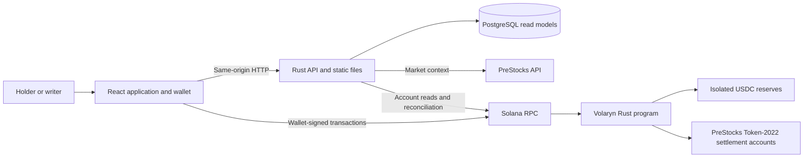
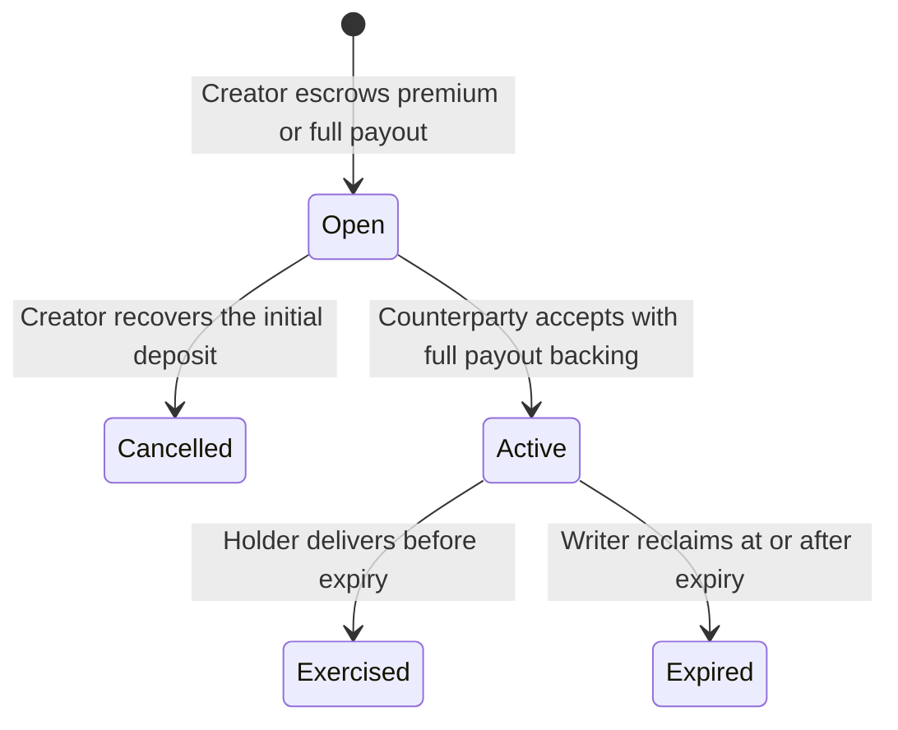

# Volaryn Architecture

This document defines the system's responsibilities, financial rules, integrations, and deployment contract. The [README](../README.md) introduces the product; the [product brief](product.md) explains its user problem, agreement, related products, and boundaries. The [technology stack](tech-stack.md) defines dependency choices, rationale, and compatibility requirements. Paths, APIs, and commands below define the implementation contract.

The [technical overview](technical-overview.md) provides linked UML diagrams and code entry points for presenting these mechanisms in a technical demo.

## 1. Design constraints

Volaryn connects a PreStocks holder seeking temporary downside protection with a writer willing to acquire that position under agreed terms. The holder keeps the underlying until exercise; the writer commits the entire USDC payout before activation.

| Requirement                      | Architectural consequence                                                                                                                            |
| -------------------------------- | ---------------------------------------------------------------------------------------------------------------------------------------------------- |
| A concrete holder problem        | Position discovery and protection are the primary workflow.                                                                                          |
| A complete, demonstrable outcome | Funding, activation, independent exercise, and unused-expiry recovery use the actual Solana program.                                                 |
| A reason to use Solana           | Program-controlled collateral and atomic settlement enforce the agreement.                                                                           |
| Execution quality                | Exact asset identity, visible funding, explicit transaction status, and failure-safe transfers are core behavior.                                    |
| Meaningful PreStocks integration | Official mints, market context, token mechanics, and asset lifecycle determine eligibility and presentation. Competing pre-IPO issuers are excluded. |
| Simple operation                 | One Rust application process, a bundled React frontend, PostgreSQL, and a reproducible Compose entry point.                                          |

The first five requirements reflect the [Stocklana brief and sponsor criteria](https://hackathons.solana.com/hackathons/stocklana). Submission schedules and prize administration belong outside this architecture.

The financial scope is one fixed-quantity agreement proposed by either participant, one holder, one writer, and one full exercise. There is no pooled collateral, margin, liquidation engine, secondary options token, automated market maker, or reserve investment. A writer-origin buy offer reserves the payout; a holder-origin sell request escrows the premium and becomes protected only when a writer funds it. A price estimate is not an executable commitment.

Each model field must serve a concrete behavior, invariant, observation, or semantic boundary such as an account version. Remove superseded representations and unused fields. During initial development, reshape interfaces and the initial database schema directly; compatibility layers are justified only by data or clients that actually require continued support.

## 2. System shape and dependencies

Use a **modular monolith** for the application and a separate **on-chain settlement program**. Application modules share one process and database; the chain is the authority for financial rights.



The browser's normal RPC transport is a restricted same-origin backend proxy. The diagram separates transaction authorship from transport: the wallet signs, the backend forwards, and the program decides. An independently hosted client can submit the same instructions through another RPC.

| Area                    | Selected dependencies                                                                 | Purpose                                                                                                        |
| ----------------------- | ------------------------------------------------------------------------------------- | -------------------------------------------------------------------------------------------------------------- |
| Backend                 | Rust, Tokio, Axum, Tower, `tower-http`                                                | Async HTTP, static frontend delivery, request limits, and tracing middleware.                                  |
| External access         | `reqwest` with Rustls; nonblocking `solana-rpc-client` and compatible types           | PreStocks HTTP and typed chain access without a separate integration service.                                  |
| Persistence             | PostgreSQL through SQLx with embedded migrations                                      | Durable projections and observations in one transactional database; no ORM layer.                              |
| Data and errors         | Serde, `serde_json`, `thiserror`, `tracing`, `tracing-subscriber`                     | Typed boundaries, stable errors, structured logs, and exact off-chain numeric handling.                        |
| Program                 | Rust, Anchor, `anchor-spl`, Token-2022 interfaces                                     | Account constraints, PDA authority, and extension-aware token operations.                                      |
| Frontend                | React, TypeScript, Vite, React Router, CSS Modules                                    | A static application with feature modules; no server-side rendering service.                                   |
| Wallet and transactions | Solana Kit HTTP RPC, Wallet Standard plugin, React bindings, generated program client | Wallet discovery, account decoding, signing, and HTTP-based submission and confirmation.                       |
| Generated contracts     | Anchor IDL and Codama; Utoipa, `openapi-typescript`, `openapi-fetch`                  | Generate matching program and HTTP clients; only generated code and client helpers enter the frontend runtime. |
| Verification            | Rust tests, LiteSVM, Vitest, Playwright                                               | Financial invariants, adapter behavior, frontend logic, and complete browser interactions.                     |

The [technology stack](tech-stack.md) is the reference for package selection, alternatives, and toolchain compatibility. Keep native React state and typed HTTP helpers; generate the Kit-compatible program client from the IDL. Build-time generation and test tooling do not add runtime services. Dependency changes must pass the stack's compatibility gates.

### Repository layout

```text
volaryn/
├── Cargo.toml                 # Rust workspace: backend, program, local tooling
├── Cargo.lock
├── rust-toolchain.toml
├── Anchor.toml
├── backend/
│   ├── build.rs               # Track embedded migration files
│   ├── src/{http.rs,application.rs,domain.rs,observations.rs,adapters/}
│   └── migrations/
├── frontend/
│   └── src/{app,features,components,lib}/
├── programs/volaryn/src/      # Instructions, accounts, token rules, errors
├── packages/protocol/         # Generated IDL and TypeScript program client
├── config/                    # Network manifests and reviewed asset policies
├── tools/
│   ├── localnet/              # Validator bootstrap and disposable fixtures
│   └── test                  # Native fast checks and containerized test modes
├── tests/                     # Program scenarios and browser flows
├── package.json               # npm workspace and build scripts
├── package-lock.json
├── Dockerfile                 # Application, local tooling, and build targets
├── compose.yaml               # Self-contained local demonstration
├── compose.test.yaml          # Isolated test overrides and one-shot runner
├── compose.live.yaml          # Application connected to an existing deployment
├── README.md
└── docs/
    ├── architecture.md
    ├── product.md
    ├── pipeline.md
    └── tech-stack.md
```

`http` validates transport input and calls `application`; application services coordinate domain rules and adapter interfaces. `domain` has no HTTP, database, or SDK dependency. Public deployment and chain-observation DTOs live in `observations`, where serialization and API-schema annotations belong. Adapters implement chain reads, asset context, and persistence. Jobs call the same services as request handlers. Define interfaces at those external boundaries, not one interface per class or table.

The program owns settlement validation independently of backend checks. Frontend features cover positions, offers, protection, and writer commitments; shared components contain presentation rather than financial rules. Generated files are never hand-edited. The workspace build regenerates them and checks for drift.

### Business changes and extension boundaries

Keep the product adaptable through cohesive modules and a few explicit boundaries. Introduce an interface where an external dependency must be replaceable or isolated for tests; keep ordinary business logic in concrete functions and types. Extract a strategy only when a real second behavior needs independent selection. No plugin framework, generic workflow engine, interface per entity, or environment switch per feature is required.

| Change                                                   | Owning boundary and preserved contract                                                                                                                                                              |
| -------------------------------------------------------- | --------------------------------------------------------------------------------------------------------------------------------------------------------------------------------------------------- |
| Replace a data or RPC provider                           | Adapters normalize identity, units, freshness, and errors into application types. Provider payloads do not become domain or UI contracts.                                                           |
| Change discovery, offer presentation, or suggested terms | Application use cases and frontend feature modules evolve together. Suggestions remain separate from signed requests, reserved payouts, and active protection.                                      |
| Change asset admission or commercial rules               | Admission policy governs new commitments. Any new fee or economic rule is explicitly disclosed and enforced in the agreement version that supports it; active terms remain unchanged.               |
| Change storage or indexing                               | Read-model query and checkpoint operations belong to the persistence boundary. SQL and database transactions stay inside the adapter.                                                               |
| Extend financial rights                                  | Versioned program instructions own authorization and settlement; generated clients expose those operations to application features. A backend configuration change cannot create an on-chain right. |

Wire concrete adapters at application startup using the committed deployment configuration. Add only the operations a use case needs; avoid a generic repository or universal settlement interface. Frontend features consume typed application models and generated transaction clients through shared helpers, so changing a provider does not require rewriting screens. Expose actions supported by the configured program and agreement version; unknown versions must not be presented as executable.

## 3. Sources of truth and integrations

| Information                                          | Authority                                                        |
| ---------------------------------------------------- | ---------------------------------------------------------------- |
| Agreement terms, holder, status, reserve, settlement | Solana program and token accounts                                |
| Wallet inventory and transfer capabilities           | Token accounts, mint state, and their owning token programs      |
| PreStocks identity and market context                | Official PreStocks data, checked against reviewed mint admission |
| Supported assets and permitted new expiries          | Versioned asset policy, with critical limits enforced on chain   |
| Search results and dashboards                        | Rebuildable PostgreSQL projections                               |
| Pending transaction feedback                         | Browser transaction state, reconciled against chain confirmation |

### PreStocks

The backend reads public asset context from [`GET https://prestocks.com/api/prestocks`](https://prestocks.com/api/prestocks). The adapter maps `contract_address`, `name`, `symbol`, `tokenPrice`, `markPrice`, `impliedValuation`, `markValuation`, and `supply` from the response. Public reads use no API key; API availability and response shape remain external dependencies, not settlement prerequisites.

Normalize this response through a typed adapter with bounded timeouts, retries, schema validation, and caching. Join assets by exact mint and network, never by ticker. API additions do not automatically become tradable. Preserve source provenance and `received_at`; receipt time must not be labelled price time. A market observation timestamp requires explicit source evidence. Missing values remain unavailable rather than becoming zero.

Official context uses a separate read-only catalog in the same backend process. Its sources are loaded lazily, independently of settlement, local fixtures, and index readiness. `config/assets.json` binds the reviewed mainnet profile and lifecycle evidence. `GET /api/assets/official` exposes compatibility reasons and per-source freshness; a compatible observation still requires matching on-chain policy and deployment admission before trading. See [asset integration](asset-integration.md) for transport bounds, token compatibility, and verification.

Wallet discovery uses [`getTokenAccountsByOwner`](https://solana.com/docs/rpc/http/gettokenaccountsbyowner) for Token-2022 holdings and the applicable USDC token program. Read mint state for decimals, extensions, and authorities. Aggregate holdings for display while retaining individual account identities and spendable balances.

**Mint validation:** backend admission checks each official mint through [Solana's account RPC](https://solana.com/docs/rpc/http/getmultipleaccounts) on the selected network. It compares the owning token program, decimals, authorities, and extension configuration with the reviewed registry, including transfer fees, scaled UI amounts, permanent delegates, pausing, freeze authority, confidential transfers, and transfer hooks where present. The program independently enforces supported transparent-transfer behavior and its on-chain asset policy; it does not store or compare the registry's full issuer-authority profile. Direct program callers remain subject to those on-chain rules without passing through the backend's richer review. Read the fee schedule applicable to the transaction's epoch; never hardcode an issuer-wide fee, asset count, decimal precision, or extension set. Recheck transfer-relevant configuration during transaction review.

### Quantity and issuer transfer rules

The agreement fixes **`quantity_raw`: the gross base-unit debit from the holder**, not a display balance or a guaranteed net writer receipt. If the supported mint applies an issuer-level transfer fee, the writer accepts that fee exposure. During exercise the holder transfers exactly the agreed quantity and receives the entire agreed USDC payout; any applicable issuer fee reduces the underlying credited to the settlement account. The program records the actual spendable credit. No additional holder quantity or writer approval is requested when a fee changes. This follows Token-2022's [transfer-fee semantics](https://solana.com/docs/tokens/extensions/transfer-fees).

Before signing, both parties see the gross quantity, estimated issuer fee, estimated net receipt, fixed USDC payout, premium, and expiry. Every request and offer stores the gross-quantity interpretation explicitly. The platform fee is zero in this design; network fees and account rent are separate and never deducted from the payout.

[Scaled UI amounts](https://solana.com/docs/tokens/extensions/scaled-ui-amount) affect presentation, not raw balances. Wallet balances, offer filters, creation inputs and agreement terms use explicitly labelled **unscaled token units**: raw base units divided by the mint's decimal precision. The signing review also shows the exact integer base-unit obligation. An issuer-scaled amount copied from another wallet is not interchangeable with this input. Any issuer-scaled display or input conversion must use the token program's conversion semantics, preserve the resolved raw obligation through review and signing, and apply the same convention across balances and actions. A multiplier change cannot rewrite the agreement. Market-value calculations require a verified match between the API price unit and displayed token unit; otherwise show the source values separately and disable derived percentage/valuation presets.

Support ordinary transparent transfers for reviewed Token-2022 extension combinations. Mint-level confidential-transfer configuration is not a promise to support confidential balances. Unknown extensions or an active, unreviewed transfer hook prevent new admission; unsupported issuer changes can also make an existing transfer fail atomically. Do not accept arbitrary hook programs or additional CPI accounts.

### Asset policy and lifecycle

A reviewed policy binds network, mint, token program, decimals, supported extension behavior, official source, review date, review-validity deadline, admission status, and maximum expiry. The on-chain `AssetPolicy` enforces enablement, review validity, and expiry limits at offer creation and activation. The richer evidence stays in versioned configuration. Administrative policy transactions are signed outside the application process.

Lifecycle limits come from reviewed official notices, such as the [SPACEX notice](https://prestocks.com/spacex) and [XAI notice](https://prestocks.com/xai); a market-data response alone does not establish eligibility. Store each applicable deadline and its source in the asset policy. Set maximum protection expiry strictly before any applicable conversion deadline, with an explicit reviewed buffer. Missing or outdated policy blocks new agreements.

Recheck policy at activation. Subsequent policy changes can stop new commitments but cannot change an active agreement's mint, quantity, payout, or expiry, or introduce an administrative exercise veto. Display new lifecycle warnings on active protection. There is no automatic migration into a replacement mint.

### Optional Pyth context

Pyth is an optional market-context adapter, absent from the core runtime dependency graph. Its data may support a meaningful comparison or writer decision, but never authorizes exercise or determines payout.

The [official pre-IPO announcement](https://www.pyth.network/blog/anthropic-openai-pre-ipo-feeds-on-pyth) identifies OpenAI and Anthropic indicators as **Pyth Indices**, with commercial terms separate from Pyth Pro. Do not assume a public Hermes feed, a Pyth Pro entitlement, or a directly comparable PreStocks token price. Enabling this adapter requires verified API access, units, provenance, and usage rights. There is no mandatory Pyth package, credential, or environment variable.

## 4. On-chain agreement

Use one Anchor program. Each agreement has its own reserve; funds cannot back multiple agreements.

### Settlement engine choice

A dedicated Rust/Anchor program is the reference design specified here. Existing infrastructure such as [Epicentral's Solana Option Standard](https://beta.epicentral.markets/) is a reuse candidate, subject to verification against the same requirements: exact PreStocks Token-2022 behavior, fixed gross delivery, isolated full USDC backing, holder custody until exercise, atomic settlement before expiry without a price oracle or fresh writer approval, and lifecycle restrictions on new agreements. Any protocol fees must preserve the full promised payout and the documented cost model.

Reuse also requires inspectable program behavior, deployment and upgrade controls, suitable licensing, and reproducible local tests. An alternative settlement engine must satisfy the [settlement invariants](#7-trust-boundaries-and-verification), with its dependencies and integration contract defined in this specification.

### Accounts

| Account                             | Responsibility                                                                                                                                                                                                                                     |
| ----------------------------------- | -------------------------------------------------------------------------------------------------------------------------------------------------------------------------------------------------------------------------------------------------- |
| `ProtocolConfig`                    | Deployment identity, exact USDC mint/program, and policy authority. Settlement identity is immutable for a deployment.                                                                                                                             |
| `AssetPolicy`                       | Admit a specific underlying and constrain new agreements.                                                                                                                                                                                          |
| `Agreement` PDA                     | Agreement version, immutable creator and origin side, unique nonce, optional designated counterparty, optional writer/holder until matched, exact mints/programs, raw quantity, payout, premium, deadlines, policy version, timestamps, and state. |
| Reserve token account               | Escrows the premium for an open holder request or the payout for an open writer offer and any active agreement; the PDA controls spending.                                                                                                         |
| Underlying settlement token account | Receives the exercised underlying; controlled by the PDA until atomic handoff to the writer.                                                                                                                                                       |

Agreement addresses derive from a fixed seed, immutable creator address, and unique nonce. Version 2 records `side = Writer | Holder`; the creator occupies that economic role from creation, and the opposite role is absent until acceptance. Both roles are fixed after activation. The side remains the offer's origin, not the connected viewer's role. Retain terminal agreement records to prevent reuse and permit account-based reconstruction. Validate account ownership, PDA seeds, signers, mint identities, token programs, and authorities using [Anchor constraints](https://www.anchor-lang.com/docs/references/account-constraints).

### Agreement evolution

Record an explicit agreement version from creation, binding its account layout and financial rules independently of the asset-policy version. Keep economic terms, participant authorization, and lifecycle transitions separate in program code. The base agreement binds exercise authority to the activated holder and provides no transfer instruction. Do not allocate speculative transfer fields or build a second financial model in advance.

The repository implements one current agreement format, with matching generated clients and application code. Identify records by network, program, and agreement address; reject unsupported versions rather than maintaining historical decoders. Incompatible development changes replace the format and recreate disposable local state using [local development reset](development.md#local-development-reset). A deployment carrying live rights requires a separately designed preservation plan before changing those rights; no conversion mechanism is included. Versioning does not remove the trust placed in a [program upgrade authority](https://solana.com/docs/programs/deploying#program-management).

For example, a transferable-right variant would add an explicit on-chain change of exercise authority, define sender authorization and recipient consent and eligibility rules, and route exercise and payout to the authorized holder. The recipient must still satisfy the asset-delivery requirement. Its tests must resolve transfer/exercise races, reject transfers after exercise or expiry, reject the previous holder after transfer, and preserve the reserve, writer identity and obligation, premium, quantity, payout, and expiry. This is a future product decision, not an implicit capability of the base agreement; it does not require introducing an option token or marketplace into this design.

### State machine



An unaccepted offer becomes unavailable at its acceptance deadline; its creator can cancel and recover the initial premium or payout. `Open` does not itself mean a funded exercise right. For active agreements, expiry is effective by chain time even before a reclaim transaction changes the stored state. There is no scheduler required for correctness.

### Funding and activation

`create_offer` requires the creator's signature, valid policy, positive quantity, payout, and premium, and `now < accept_before <= expires_at`. It initializes the agreement and both token accounts, with rent paid by the creator. Both cash amounts use the exact USDC mint and program bound by `ProtocolConfig`. The origin selects the initial deposit and acceptance instruction:

| Origin                  | Creation deposit                                                 | Acceptance                                                                                                 | Result                                                        |
| ----------------------- | ---------------------------------------------------------------- | ---------------------------------------------------------------------------------------------------------- | ------------------------------------------------------------- |
| `Holder` — sell request | Holder escrows the exact premium; tokens remain in their wallet. | `accept_request`: a different signing writer deposits the full payout, then receives the escrowed premium. | The reserve holds the full payout and both roles are fixed.   |
| `Writer` — buy offer    | Writer reserves the full payout.                                 | `activate`: a different signing holder pays the premium directly to the writer.                            | The reserve retains the full payout and both roles are fixed. |

Acceptance checks the origin-specific instruction, optional designated counterparty, current policy, exact account identities, exclusive deadline, and sufficient reserve. Deposit, premium payment and activation are atomic: a failed transfer leaves the request open with its original escrow and no assigned counterparty. The writer must fund the entire payout before receiving the premium; a net deposit cannot substitute for full funding. The underlying is neither locked nor sold at creation or acceptance. Delivery requires the exact spendable quantity when exercising.

Self-designation and self-acceptance are rejected for both origins. An unrestricted request can be accepted once by any other eligible wallet in the missing role. Cancellation and acceptance racing on the same agreement cannot both succeed. After activation, the writer has earned the premium and keeps it whether the holder exercises or lets protection expire.

### Independent exercise

`exercise` requires the recorded holder's signature, `Active`, and `Clock.unix_timestamp < expires_at`. It consumes the entire right once; partial exercise is not supported. In one atomic instruction it:

1. Validates the fixed account identities, reserve, and holder's spendable source balance.
2. Transfers `quantity_raw` to the predefined underlying settlement account using the admitted token behavior, and measures the credited amount.
3. Pays the exact reserved USDC amount to a holder-owned account.
4. Transfers ownership authority of the underlying settlement account to the immutable writer and records `Exercised` and the net credit.

Any failure rolls back every transfer and state change. There is no price threshold, oracle read, fresh writer signature, backend authorization, or mutable admission-policy check in this path.

The settlement account is a **custom token account, not an associated token account**. Allocate it for the actual mint-required extensions and initialize it without `ImmutableOwner` or `CpiGuard`, with no delegate and no separate close authority. This permits the PDA to hand token-account authority to the recorded writer through Token-2022 `SetAuthority`; its runtime owner remains Token-2022. The writer cannot modify the destination before exercise. Handoff gives the writer control of the received balance without a second mandatory token transfer; later consolidation may incur an issuer fee. This design follows the [official authority implementation](https://github.com/solana-program/token-2022/blob/bb07b98567d5519e4cfcfdd05e9a0b283f6c0cae/program/src/processor.rs#L709) and [immutable-owner rules](https://solana.com/docs/tokens/extensions/immutable-owner). Compatibility tests against the pinned program validate account initialization and authority handoff for each admitted extension combination.

The client must discover this non-associated writer account. Exercise accepts one holder-owned source account containing the required spendable raw quantity. If holdings are split, the UI explains any consolidation and its transfer fees before asking for approval; it never silently changes the contractual quantity.

### Expiry, refunds, and account cleanup

At `now >= expires_at`, exercise is rejected and `reclaim_expired` allows the writer to recover USDC and records `Expired`. `cancel_offer` only applies to `Open` and requires its creator: it returns the premium for a holder request or payout for a writer offer to that creator's verified USDC account. Reclaim requires the active agreement's writer and returns its payout to a writer-owned account. Active collateral cannot be withdrawn, lent, or used to pay platform expenses.

Require at least the side-specific initial escrow while open and at least the full payout while active, never strict equality: unsolicited transfers must not break a valid agreement. Measure underlying delivery by the balance delta, not the settlement account's total. `cleanup_terminal` requires the terminal beneficiary: the creator after cancellation, or the writer after exercise/expired reclaim. It recovers reserve surplus to that beneficiary and can hand over any still-PDA-controlled underlying account instead of requiring it to be empty. After exercise the writer already controls that account. Rent recovery is optional; dust, issuer restrictions, or withheld fees must never gate exercise or a reserve refund. Terminal agreement records remain allocated.

## 5. Application behavior and API

The backend serves a same-origin REST API, static frontend files, and bounded background polling. It holds no live holder, writer, policy, or deployment private keys. Public account data needs no login; all financially meaningful mutations require on-chain signatures. There are no email accounts, JWT sessions, custodial wallets, or server-side transaction signing.

| Surface                                                                                            | Responsibility                                                                                                                     |
| -------------------------------------------------------------------------------------------------- | ---------------------------------------------------------------------------------------------------------------------------------- |
| `GET /api/config`                                                                                  | Public deployment schema, network/program identity, USDC mint, supported assets, and demo status; never provider secrets.          |
| `GET /api/assets`                                                                                  | Assets declared by the connected deployment, with explicit fixture provenance.                                                     |
| `GET /api/assets/official`                                                                         | Read-only mainnet issuer catalog, reviewed compatibility, lifecycle limits, and independent source freshness.                      |
| `GET /api/admission?mint=...`                                                                      | Current mint and policy eligibility for new commitments, checked independently of existing exercise and refund paths.              |
| `GET /api/release`                                                                                 | Serving source revision, program fingerprint, and localnet build flag.                                                             |
| `GET /api/wallet?owner=...`                                                                        | Separate supported USDC and underlying accounts, exact balances, frozen state, and each read's finalized slot.                     |
| `GET /api/offers?mint=...`                                                                         | Open requests/offers before acceptance ends, with side, designated counterparty, observed slot, and side-specific escrow evidence. |
| `GET /api/agreements?owner=...`, `?holder=...`, `?writer=...`, and `GET /api/agreements/{address}` | Holder/writer views, exact terms, reserve, stored on-chain status, and deadlines.                                                  |
| `GET /api/activity?owner=...&before=...`                                                           | Wallet operation receipts, 50 per page, plus unresolved receipts independent of the history cursor.                                |
| `POST /rpc`                                                                                        | Bounded allowlist of required account-read, simulation, blockhash, status, and signed-transaction submission methods.              |
| `GET /health/live`, `GET /health/ready`, `GET /health/index`                                       | Process liveness, verified chain transport, and index availability respectively.                                                   |

List endpoints also support exact `quantity_raw`, `min_payout`, `max_premium`, and `eligible_counterparty`; monetary filters are canonical base-unit strings validated as `u64` and compared numerically. `eligible_counterparty` excludes offers created by that wallet and offers designated for another wallet, before pagination. The connected offer market applies this filter; writer portfolio and direct agreement reads remain available. `side=holder` selects holder-origin sell requests; `side=writer` selects writer-origin buy offers, independently of the connected wallet's role. No filter resizes an offer. List endpoints accept `after`, `limit` (default 50, maximum 200), `owner`, `creator`, `holder`, `writer`, `side`, `mint`, `status`, and `lifecycle`. `owner` selects `(writer = owner OR holder = owner)` before pagination, excluding designation alone; combining it with a role or lifecycle narrows that result. Responses remain arrays, with `X-Next-Cursor` only when another page exists. Address ordering provides keyset pagination; each page is a fresh observation, not a frozen snapshot across requests. The agreement detail endpoint performs a primary-key lookup and falls back to a direct chain read if the projection is missing, stale, or unavailable.

The API returns the recorded on-chain status. Its optional `lifecycle` filter selects `available`, `acceptance_ended`, `active`, `exercised`, `cancelled`, or `expired` before pagination without rewriting that status. Deadline-dependent selections use an observed confirmed block time, matching the frontend clock source; unavailable chain time fails the filtered read instead of substituting server time. Terminal exercised/cancelled selections need no clock. Expired combines active agreements past expiry and recorded expired agreements. The frontend combines that status with deadlines and observed chain time to present an expired right or closed acceptance window before a reclamation transaction changes the account. Offer discovery filters its indexed deadline against the same observed chain time and reserve evidence; unavailable chain time fails the offer read; policy and transfer eligibility are checked during transaction review, then rechecked before signing. A listed offer is not a guarantee that activation is currently permitted.

First-seen supported signed submissions must also pass server-side simulation of the exact signed bytes before receipt insertion and relay. Signature verification stays enabled, the blockhash is unchanged, and the simulation context cannot predate the observed lifetime check. Existing durable receipts bypass repeat simulation; neither simulation nor a relay acknowledgement establishes finalization. There is no REST endpoint that makes a protection active in PostgreSQL. Clients construct instructions from the generated program client, reread relevant chain accounts, review costs and restrictions, ask the wallet to sign, require the returned message bytes to match the reviewed transaction exactly, submit with RPC preflight simulation enabled, and observe confirmation. This check includes the blockhash: a wallet-modified message fails before the application saves a signed pending record or broadcasts it, keeping the recorded lifetime consistent with the signed bytes. A response or signature alone is not financial success.

The [offer lifecycle](offer-lifecycle.md) defines agreement states separately from operation attempts. Track preparation, wallet approval, interruption, submission, provisional confirmation, finalization, failure, expiry, and unresolved outcomes distinctly. Display confirmed results as provisional until finalized. On a timeout, query signature status and account state before offering another attempt; refresh an expired blockhash only after reconciling the earlier attempt. Replays cannot pay twice because program state transitions are single-use.

A persistent browser journal holds one pending action per network, program, and signing account, including its agreement, operation, public signature, and last valid block height. Creation also records immutable public offer terms to verify the intended agreement if signature history becomes unavailable. After reloading or reopening a tab, restoring the same wallet resumes observation. Completed attempts remain in browser history instead of being discarded with the pending journal. Web Locks serialize signing and journal changes across tabs on the same origin; a new action rereads the journal while holding the lock. Private keys and signed transaction bytes are never persisted. Storage failure prevents new submissions rather than discarding an unknown outcome. The RPC relay verifies the signed instruction and records its public receipt in PostgreSQL before forwarding it. A separate bounded worker reconciles these receipts without an open browser. Signed operations recover across devices; unsigned attempts remain in their originating browser. A database failure prevents new tracked submissions while read-only RPC remains usable. Clearing browser data discards local recovery records; it cannot undo a chain transaction or erase server receipts.

Submission allows a bounded RPC rebroadcast of the same signed bytes. A replacement signature is never created automatically. Confirmed errors remain provisional until finalized. After the finalized block height exceeds the signature lifetime, reread signature history and the agreement at or beyond that finalized root. Version 2's immutable creator, origin and matched roles plus monotonic activation/settlement history can establish whether the action completed; label this as an effect verified from agreement state, not proof of the original signature's inclusion. Unsupported identities or ambiguous history remain unresolved. New contract semantics, including transferable rights, require an updated reconciliation policy.

Use Rust integer base units with checked arithmetic and wider intermediates, TypeScript `bigint`, and decimal strings over Volaryn's REST API. Solana JSON-RPC keeps its own numeric encoding through Kit's lossless transport and the proxy; never convert financial values through JavaScript numbers. Timestamps use UTC; the program's clock decides expiry. Return stable REST error codes with human-readable messages, including expired offer, wrong network, unavailable asset data, insufficient deliverable balance, and issuer-restricted transfer; preserve JSON-RPC result/error envelopes on `/rpc`.

**Home** explains the product and participant roles without loading an agreement list. **Explore offers** presents compact cards linked to full agreement details. **Create offer** has a dedicated form and funding review; **My portfolio** defaults to **All**, combining the connected wallet's purchased protection and written offers. **My protection** and **My offers** narrow by role, an independent status selector narrows the lifecycle, and **Activity** retains operation history separately. It retains completed agreements and displays pending creations or acceptances in the actor's role view before projection discovery. Receipts carry immutable offer `side` and signing `actorRole`; create/cancel/activate names cannot determine the role alone. An already present holder on an open request is not evidence of activation: recovery must observe the accepting writer and an activation timestamp. Page components own discovery and presentation; wallet signing, review, and pending transaction recovery remain shared across route changes.

**Your wallet** starts from verified supported wallet holdings. **Explore offers** filters open requests and offers by exact mint, selected quantity, acceptable terms, counterparty restrictions, side-specific escrow, and the acceptance deadline. Origin tabs separate All offers, Sell requests, and Buy offers; text badges accompany their colors. Review checks admission policy and current transfer conditions before activation. Each offer retains its fixed quantity and terms; the client cannot resize it to fit a position. When no request or offer matches the selected filters, show that result explicitly. A failed or stale lookup is an availability error, not evidence that no offers exist; neither case produces a synthetic executable quote.

Offer suggestions separate confirmed policy reads in `lib/chain/offerContext` from pure date and premium calculations in `features/offers`. Form state owns editable values and never feeds rounded display percentages back into money. These templates use no price oracle or issuer-price request; the existing preparation and signing path remains authoritative. The [offer lifecycle](offer-lifecycle.md#suggested-offer-terms) defines default values, policy limits, manual overrides, and unavailable-data behavior.

All connection buttons open one shared, labelled native modal on the current route. It discovers installed Solana Wallet Standard providers, including Phantom, with a mainnet installation link when Phantom is absent. Chain or signing incompatibility disables a provider without treating it as uninstalled. The dialog reports rejection, supports keyboard dismissal, and restores focus; cancellation invalidates the pending connection so a late approval cannot select or persist that wallet. Localnet builds alone register and display **Test Wallet 1** and **Test Wallet 2**. An optional mainnet WalletConnect adapter exposes QR pairing and signing through Wallet Standard, preserving the common Kit signer and submission path. The Sign SDK loads on demand; enabling it requires the public build-time project ID described in [deployment configuration](deployment.md#optional-walletconnect-pairing).

Public agreement browsing is distinct from wallet holdings. The first visit starts disconnected. Later visits restore an authorized wallet silently after verifying the deployment identity; its public preference is scoped to the genesis hash and program. Explicit disconnect clears that preference. Balance requests are scoped to the connected address. Disconnecting removes personal observations from view. The interface displays the connected wallet identity and identifies preloaded local test balances. An active agreement is described as personal protection only when its holder matches that address; another holder's agreement remains read-only. Pending transaction recovery resumes when the same wallet reconnects, without automatic signing or resubmission.

Background reads preserve the last observation, including empty results, while the next request is pending. Loading placeholders belong to the first read for a wallet or query; routine polling does not insert status rows, reset forms, or toggle usable controls. A failed observation remains unavailable throughout retries until a successful response clears the error. Request scheduling uses the actual in-flight state separately from this presentation state.

**Review Offer** shows gross quantity, estimated net writer receipt, payout, USDC premium, acceptance deadline, protection expiry, reserve evidence, required source balance, and transaction costs. Present token price, mark price, implied valuation, and mark valuation as separately labelled context, distinct from the contractual payout. Refresh eligibility, funding, and holder balances before signing. **Active Protection** exposes holder-initiated full exercise and its deadline; a price fall never triggers automatic exercise. Separate an active right from the holder's ability to deliver: underlying can be moved or sold, and one balance cannot satisfy multiple exercised agreements. Avoid claims that the USDC payout is a net investment return or a guaranteed dollar value.

**Create offer** defaults to a holder request with premium escrow; a compact mode switch selects a writer offer with payout funding. **My portfolio → My offers** supports locating agreements for cancelling unaccepted offers, inspecting active locked reserves, reclaiming expired reserves, and locating delivered tokens after exercise. Review includes the committed capital, estimated net token receipt, premium, duration, and issuer risks. Refunds depend on agreement and USDC state, without requiring a transferable underlying mint. Both roles can inspect agreement accounts and transaction identifiers; all actions use the same wallet-signed program instructions described above.

### Read models and recovery

PostgreSQL stores deployment identity, agreement projections, reconciliation cursors, and signature-authenticated operation receipts. Official mint and market observations belong to the catalog's bounded in-memory cache; they are refreshed after restart and have no database history. Receipts are application-owned history rather than a rebuildable account projection. Financial balances are observations tagged with network, program, slot, and commitment. Bounded agreement and activity workers per application write short atomic transactions; HTTP handlers do not hold transactions while waiting on upstream calls. Bounded batches upsert individual agreements under row locks in stable address order; indexing never deletes the table. Each row rejects a lower finalized slot. The reconciliation checkpoint is the highest observed slot, not a claim that all rows share one snapshot. A failed batch rolls back its rows and checkpoint together; successful earlier batches remain usable with their own observation metadata.

Persist raw financial amounts as validated decimal strings in typed JSONB projections; use bounded exact numeric columns for ordered checkpoints and dedicated fields that need numeric queries. Startup runs embedded SQL migrations under PostgreSQL migration locking before readiness. Stop the previous writer for an incompatible schema change; a lock alone does not make old application code compatible with a new schema. The [stack's persistence and migration contract](tech-stack.md#3-persistence-numeric-precision-and-migrations) defines query validation, schema compatibility, and recovery.

On startup and every thirty seconds, discover retained agreement addresses using a discriminator filter and zero-length account data. Between discovery passes, poll open and active agreements every two seconds. Fetch each agreement and its reserve together through `getMultipleAccounts`: at most fifty pairs per response and four concurrent requests. Each pair carries its actual finalized response slot; `minContextSlot` rejects reads behind the discovery or stored checkpoint. Different batches may have different slots. Discovery has a separate 32 MiB response budget; public RPC remains bounded at 2 MiB. Standard account discovery has no pagination, so a larger deployment may need an indexed source behind the same adapter. [Solana account batches](https://solana.com/docs/rpc/http/getmultipleaccounts), [account discovery](https://solana.com/docs/rpc/http/getprogramaccounts). Confirmed browser feedback stays separate from durable finalized observations. Logs can accelerate refresh but are not the sole source of truth. Missed polls, restarts, or a deleted cache cannot change agreements. Rebuilding recovers authoritative terms and states, though previously cached market history can be lost.

Stale market data disables derived pricing and new market-based suggestions; reviewed fixed offers remain governed by their on-chain terms. Stale chain reads must be labelled and refreshed before presenting an offer as executable. External-data failures never disable the contract's exercise path. If the API is unavailable, a published IDL/client and the agreement address are sufficient to exercise through another compatible RPC.

### Scaling the application

The reference deployment uses one application instance, one PostgreSQL service, and bounded reconciliation workers. Measure request latency, reconciliation lag, RPC usage, and database contention before changing that topology. Improve bounded queries, indexes, batching, and cache reuse within the existing modules first.

PostgreSQL provides shared transactional storage when measured load requires multiple application instances or independently scheduled indexing. Explicitly assign reconciliation ownership before enabling replicas so they do not duplicate RPC scans. Row-level slot guards protect data integrity but do not allocate worker ownership. Validate connection budgets, schema compatibility, concurrent updates, and recovery before changing the topology. These changes preserve the product and settlement contracts but still require operational work and compatibility tests. A separate worker or service is introduced only when independent capacity, failure isolation, or deployment is needed.

## 6. Packaging and configuration

The local deployment contract provides one entry point:

```sh
docker compose up --build
```

It serves the application at `http://localhost:8080` and requires **no environment variables, cloud account, API key, installed Rust toolchain, or installed Node runtime on the host**. Docker and Compose are the host prerequisites; the first image build needs network access.

| Compose service | Role                                                                                                               |
| --------------- | ------------------------------------------------------------------------------------------------------------------ |
| `validator`     | Local Solana ledger with the required token programs, persisted in a named volume.                                 |
| `bootstrap`     | One-shot program verification and initialization of protocol, policies, assets and funded test wallets; no offers. |
| `database`      | PostgreSQL with a named volume, health probe, and a dedicated non-superuser application role.                      |
| `app`           | Non-root Rust executable serving API and compiled React assets from a read-only filesystem.                        |

Startup waits for database and validator health, successful bootstrap, and database migrations before readiness. After startup, `/health/ready` checks verified chain transport independently of the index; `/health/index` additionally requires a responsive database and a successful reconciliation within thirty seconds. Chain identity checks are shared and cached for at most five seconds. An index outage disables indexed lists but leaves verified RPC, wallet balances, and direct agreement reads available, while tracked submissions wait for durable receipt storage. On-chain rights remain usable through an independent compatible client and RPC provider. Initial startup still requires database migrations; process liveness is independent of dependency availability. Use Compose's documented [`service_healthy` and `service_completed_successfully` conditions](https://docs.docker.com/compose/how-tos/startup-order/). Bootstrap is idempotent: reuse matching ledger/deployment state, and fail clearly on incompatible state without resetting balances. Local reset is an explicit operation, never an automatic startup repair.

Build the frontend, backend, and program in pinned Docker build targets. The application runtime contains the Rust executable, static assets, public manifests, and CA certificates. Node, Rust, Anchor, and Solana CLI tooling remain in build/bootstrap images. Run the application without root privileges and with a read-only filesystem. PostgreSQL owns its separate writable volume. Bind the application port to loopback; publish no database or internal service ports. Compose supplies disposable local database credentials; hosted deployments provision separate credentials outside the public local fixture configuration.

Under Volaryn's own demonstration policy, the local build supplies two clearly labelled disposable test wallets, each with 10,000 available test USDC and 100 unscaled units of every supported Token-2022 replica. Normal startup initializes protocol configuration, policies, assets, accounts and balances without creating offers or agreements: the market and both portfolios begin empty on a fresh ledger. Participants create their own sell requests and buy offers through the form. Ordinary restarts retain user-created agreements and spent balances; startup neither replaces expired offers nor wipes existing state. The fixtures have representative fees and scaling and execute the real program, including ownership handoff, rather than simulating balances in React. Fixture market context records its provenance and does not require PreStocks uptime. Demo signers and initialization tooling are excluded from the live build and additionally require the expected local ledger identity.

The live Compose file runs the application and PostgreSQL against an already deployed program, without the local validator or fixture initialization. Network manifests contain public program and genesis identities, executable fingerprints, authorities, settlement mint, and supported assets; they contain no provider credentials or RPC endpoint. Local launchers supply `DATABASE_URL` automatically. Live Compose mounts connection secrets and passes `--database-url-file` and `--rpc-url-file`; direct launches also accept `--database-url` or `DATABASE_URL`, and `--rpc-url`. An external deployment requires an explicit HTTPS RPC endpoint. Connections stay server-side. PostgreSQL runs on the private Compose network; a separately hosted database requires certificate-verified TLS. Ports, storage paths, and polling limits have committed defaults rather than environment switches.

The backend exposes an allowlisted RPC proxy with no caller-selected upstream URL. Request bodies are limited to two MiB and ten seconds for the complete upload; sending additional chunks does not restart that deadline. Each route has at most 32 in-flight handlers. These process limits do not replace ingress connection and rate limits for a public deployment. Validate the network and deployed program against the manifest at startup and before enabling transactions. Wallet/network mismatch fails visibly. Live deployment keys are supplied to explicit deployment tooling outside the runtime; starting Compose never deploys or upgrades a live program. HTTPS belongs at the hosting platform's ingress.

Local manifests carry a list of supported asset identities, including each local mint, reviewed mainnet reference, name, ticker, and decimals. Metadata is validated against the committed issuer registry. The selector searches those identities, while transactions use only the selected network mint. Agreement precision comes from the contract; wallet observations preserve per-mint balances and individual source accounts.

Each network manifest must bind assets to verified issuer mints on that network; an address on mainnet does not establish a corresponding asset on devnet or a local ledger. Local fixtures demonstrate mechanics and do not establish genuine PreStocks ownership. Under Volaryn's demonstration policy, claims of actual PreStocks integration require evidence tied to verified official assets. This distinction is our transparency standard; sponsor eligibility is governed by the published bounty terms.

Live packaging uses `compose.live.yaml` and the `app-live` image target. The release embeds its source revision and program fingerprint, exposes `/api/release`, and rejects an incompatible mainnet manifest. Schema 3 moves disposable participants into a local-only `localnet` block. Mainnet configuration binds native USDC, reviewed mint identities, protocol authority and explicit upgrade authority; secrets are read from server-side files. The loader, code, protocol and currency are checked in one finalized account snapshot. New mainnet commitments additionally check `/api/admission`, independently of existing exercise and refund paths. The [deployment guide](deployment.md) owns artifact promotion, read-only verification, HTTPS, updates and backup/restore procedures.

## 7. Trust boundaries and verification

Program invariants are explicit: complete backing before activation; immutable active terms; no writer withdrawal or veto while active; exact mint/program binding; atomic delivery and payout; one successful exercise; and non-overlapping exercise/reclaim time conditions. Enforce them in the program even when the UI has already checked them.

Issuer powers remain outside Volaryn's control. PreStocks authorities may freeze, pause, transfer, or burn underlying; USDC has its own restrictions. A [permanent delegate](https://solana.com/docs/tokens/extensions/permanent-delegate) and [mint pause](https://solana.com/docs/tokens/extensions/pausable) make unrestricted deliverability an invalid assumption. Describe protection as a funded right conditional on valid delivery, not insurance. Issuer restrictions can block settlement, but cannot produce a partial payout through a failed transaction.

Policy authority controls new admission only. Program upgrade authority is a separate trust assumption: an upgradeable deployment must disclose who controls it and cannot claim immutable guarantees. Live deployment requires an explicit upgrade policy and separate eligibility/legal review; no application checkbox establishes legal permission. These constraints do not add hosted services to the hackathon runtime.

| Verification boundary    | Required evidence                                                                                                                                                                                                                                                                                                                             |
| ------------------------ | --------------------------------------------------------------------------------------------------------------------------------------------------------------------------------------------------------------------------------------------------------------------------------------------------------------------------------------------- |
| Program                  | Both origins' deposits, atomic acceptance and premium payment, creator-only cancellation, side-aware cleanup, writer-offline full exercise, partial-exercise rejection, full payout, net receipt, ownership handoff, expiry/refund with premium retained, double exercise, wrong mint/program/holder, cancellation race, and atomic rollback. |
| Token behavior           | Active transfer fees and changes, scaled display changes, required extensions, custom-account sizing, no immutable owner, unset delegate/close authority, issuer freeze/pause, hook rejection, and withheld-fee cleanup.                                                                                                                      |
| Invariants               | No early reserve withdrawal, donated surplus cannot block exercise, exact expiry boundary, overflow rejection, and policy updates cannot rewrite active rights.                                                                                                                                                                               |
| Backend/client contracts | Captured official response parsing, missing fields, price-unit mismatch, stale sources, reconciliation after restart, generated-client compatibility, and explicit rejection of unsupported agreement versions.                                                                                                                               |
| Complete application     | Clean Compose startup, idempotent restart, exact-quantity offer matching, distinct empty/error states, holder/writer flows with real local transactions, explicit exercise and expiry presentation, backend-independent exercise through a second client, and local/live separation.                                                          |

Run formatting, linting, focused Rust/TypeScript tests, generated-artifact checks, a container build, and complete-flow tests in CI. Production RPC calls are read-only integration checks; tests never spend live assets. Log request IDs, agreement addresses, public signatures, source failures, and reconciliation lag without logging keys or credential-bearing RPC URLs.

### Test environment and entry points

Testing uses the same domain rules, generated clients, migrations, and compiled settlement program as the application. External adapters are replaceable at composition boundaries; test controls never add financial bypasses to the deployed program or live API.

| Layer                         | Execution environment                                                                                                                                                                                                              |
| ----------------------------- | ---------------------------------------------------------------------------------------------------------------------------------------------------------------------------------------------------------------------------------- |
| Domain and interface behavior | In-process tests with controlled inputs, application time, and external responses.                                                                                                                                                 |
| Contract and token behavior   | LiteSVM loads the compiled program and the pinned token programs used by the local validator. Signature checks remain enabled for financial scenarios.                                                                             |
| Backend and persistence       | Real isolated PostgreSQL databases with production migrations, pool settings, and the application role; deterministic market and RPC adapters for mapping, timeout, and recovery cases.                                            |
| Complete user journeys        | The local validator, bootstrap, application, and browser execute real transactions. A test wallet signs with disposable keys through the wallet interface; it can also reject or disconnect without replacing transaction results. |

Versioned fixture recipes define participants, balances, token extensions, asset policies, and source responses for both contract and browser scenarios. Native and Compose full-test runners first assert zero on-chain agreements, empty agreement and offer lists, and complete starting wallet balances, then explicitly create two funded offers through a test-only helper. That helper is separate from bootstrap and never runs during ordinary development startup. Establish all agreement states through program instructions. Each test owns its accounts and data; tests do not depend on another test's execution order. Fixture factories can express both origins' open, active, expired, and issuer-restricted scenarios without hand-editing application balances.

The contract harness controls chain time and epochs to test expiry boundaries and fee changes immediately. [LiteSVM supports changing the Clock sysvar and advancing slots](https://github.com/LiteSVM/litesvm#capabilities). Application-clock substitution is limited to off-chain freshness and retry logic. Validator/browser tests use short test expiries and bounded polling of chain state; changing browser time cannot prove contract expiry. Readiness and confirmation checks replace fixed sleeps.

The test entry points separate in-process checks from the complete localnet environment:

| Command contract        | Responsibility                                                                                                                                                           |
| ----------------------- | ------------------------------------------------------------------------------------------------------------------------------------------------------------------------ |
| `./tools/test fast`     | Native Rust linting, SBF build, IDL drift, and LiteSVM contract scenarios. No container, validator process, browser stack, or standalone formatter is required.          |
| `./tools/test app`      | Native backend and frontend checks, isolated PostgreSQL tests, generated-client and OpenAPI drift, unit tests, and local/live frontend builds. No validator is required. |
| `./tools/test docker`   | Repository formatting, release-tool unit tests, and the contract suite with pinned containerized tools. No validator or application services are started.                |
| `./tools/test full`     | Builds and checks the contract and application, then runs backend tests and complete browser and recovery scenarios in an isolated Compose environment.                  |
| `npm run test:localnet` | Runs browser and recovery scenarios against owned native PostgreSQL, validator, and application processes after the documented build prerequisites.                      |

Only `fast` and `docker` accept a contract scenario-name filter. The entry points require no operator credentials. Native checks use the pinned host development tools; containerized modes supply their own toolchains. The validator belongs to the complete localnet environment, including full application tests. Building images and dependencies requires network access; the default test scenarios use local resources and fixtures. Read-only checks against official providers run separately and report external availability distinctly from deterministic test results. The [development guide](development.md) owns prerequisites and test commands.

`compose.test.yaml` reuses the application topology and adds one-shot backend and browser test runners. Each full run receives its own Compose project, ledger, PostgreSQL volume, browser state, and fixture identities, with no published host ports; verify the merged configuration removes inherited port bindings. Browser tests use the [stack's secure loopback origin](tech-stack.md#8-repository-containers-and-deployment) so disposable wallet signing can use Web Crypto while the application can be independently recreated. The environment never mounts persistent demo or live data. Independent runs are isolated; scenarios within a shared ledger run serially unless they have separate state. The runner waits for readiness, returns a failing exit code on failed checks, exports diagnostics, and removes only its own resources. Restart/recovery scenarios retain their state within that run. Resetting the persistent manual demo remains a separate explicit action.

Scripted adapters reproduce stale data, malformed responses, unavailable RPC, and delayed or lost submission responses. Full settlement scenarios still submit to the real local validator; failure controls affect transport, not contract outcomes. Failed runs preserve a replayable scenario name, fixture version and seed, artifact versions, sanitized logs, transaction evidence, and browser traces under `artifacts/tests/`. Automatic retries must not turn an unexplained first failure into a passing result. Test runners, wallet helpers, and fault controls are excluded from live artifacts.

### Integration requirements and failure behavior

| Integration requirement                                 | Boundary and default behavior                                                                                                                                                        |
| ------------------------------------------------------- | ------------------------------------------------------------------------------------------------------------------------------------------------------------------------------------ |
| Valid PreStocks data and verified price units           | Adapter validates responses and freshness; missing or incompatible data disables dependent calculations, without blocking exercise.                                                  |
| Official asset identity on the selected network         | Verify issuer provenance and mint accounts for that network; fixtures remain labelled simulations and unsupported mints are ineligible.                                              |
| Compatible issuer extensions and valid lifecycle policy | Require reviewed admission policy and explicit transfer compatibility; invalid policy blocks new agreements while active rights retain their terms, subject to asset deliverability. |
| Authorized Pyth Indices access and comparable units     | Enable the optional adapter only with verified access and unit mapping; missing prerequisites disable that context alone.                                                            |

These requirements are enforced at their owning boundaries. The fixed agreement requires no price oracle, privileged backend signer, or more complex collateral model.
