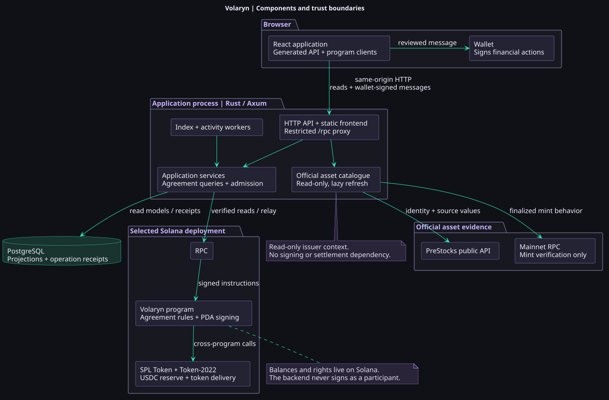
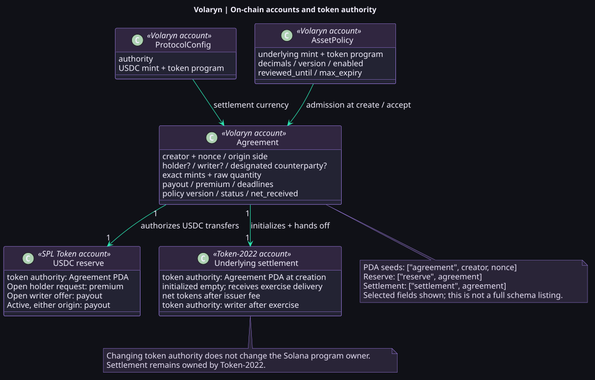
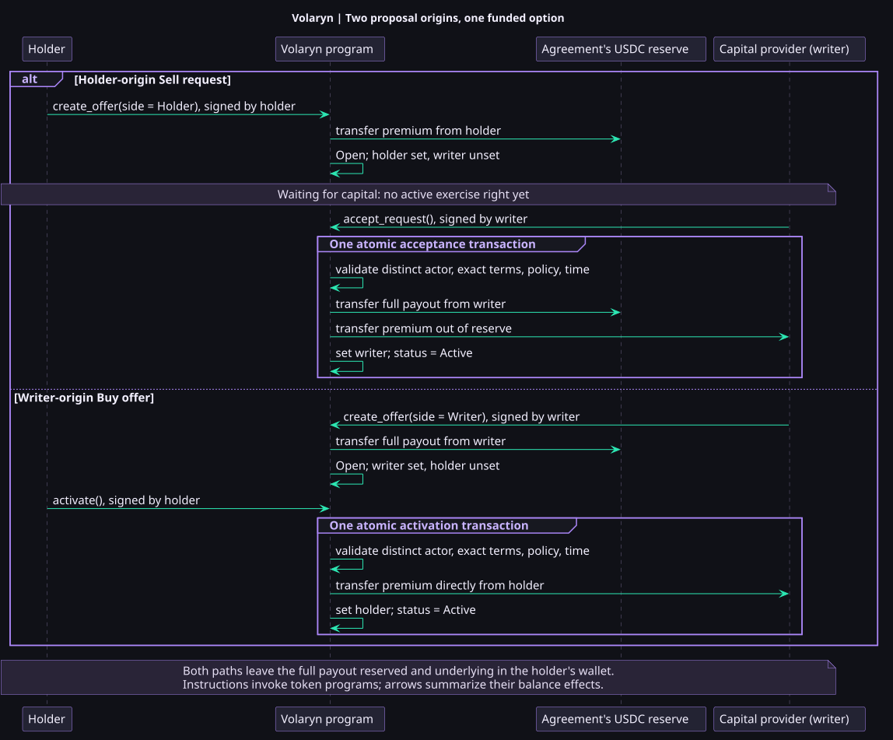
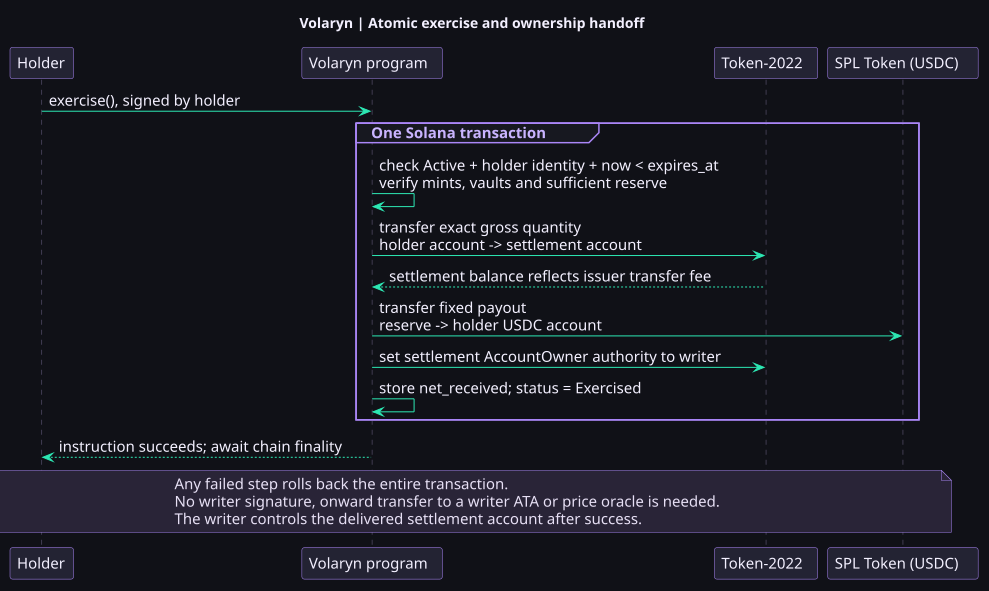
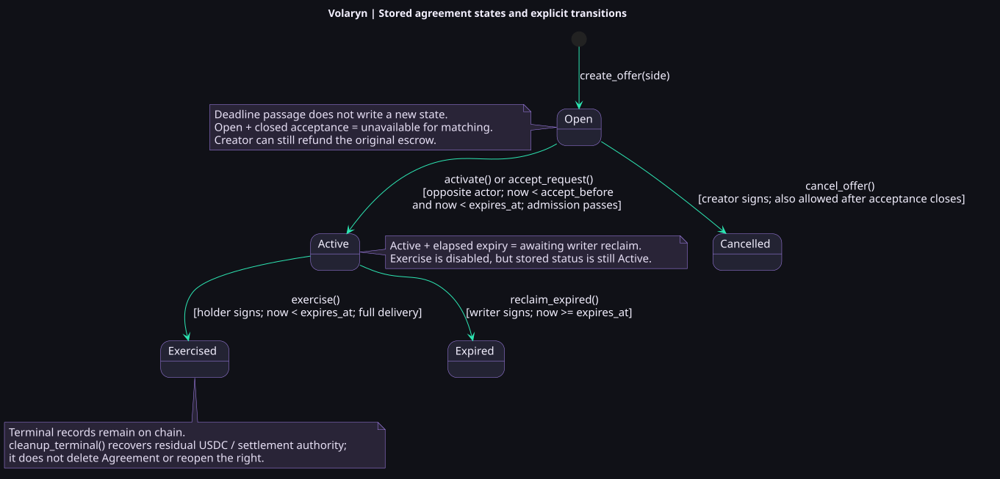
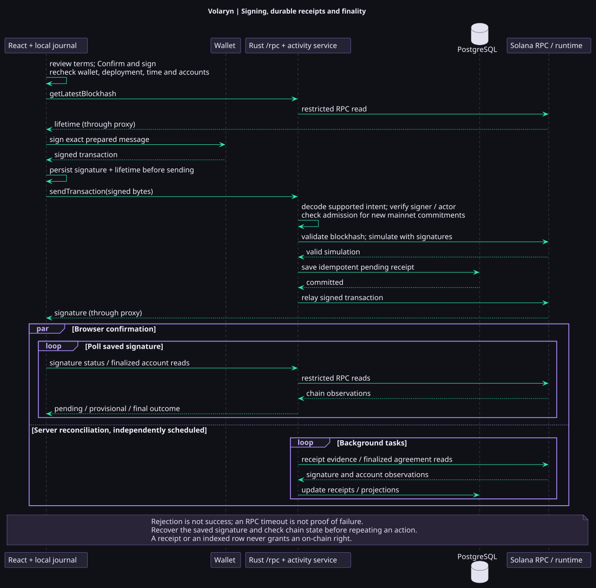
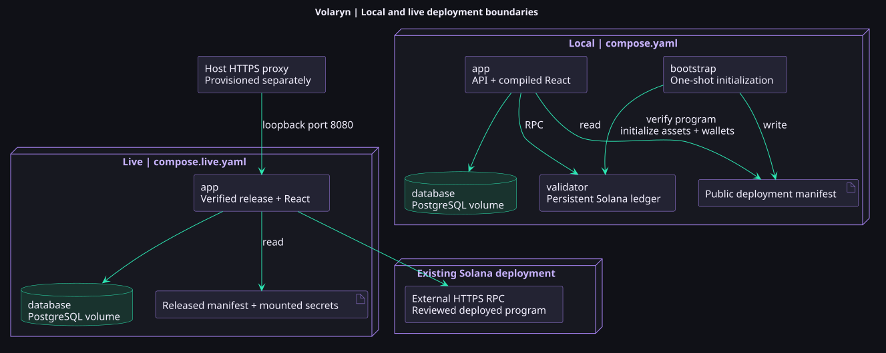

# Volaryn: Technical Overview

Volaryn gives a PreStocks holder a paid, time-limited right to deliver an exact token quantity for a fixed USDC payout. The writer supplies the capital. Either participant can propose the agreement, but protection becomes active only when the entire payout is reserved on Solana. The underlying stays in the holder's wallet until exercise.

This overview connects the product journey to the running components, accounts and instructions. Follow sections 1–7 for a technical demo; each diagram has a full-size SVG, editable PlantUML source and online editor. The [architecture](architecture.md) remains the detailed design reference, and the [two-wallet walkthrough](demo.md) supplies the browser actions.

## 1. Components and responsibility boundaries



[Full-size SVG](diagrams/components.svg) · [PlantUML source](diagrams/components.puml) · [Edit / render online][components-online]

The application is a **modular monolith plus an on-chain program**. Boxes inside the Rust application represent modules and background tasks in one process, not separate microservices.

| Component                 | Responsibility                                                                                                            | Implementation                                                                                                     |
| ------------------------- | ------------------------------------------------------------------------------------------------------------------------- | ------------------------------------------------------------------------------------------------------------------ |
| React browser application | Asset selection, balances, proposal forms, terms review, role-aware actions and activity recovery.                        | [Frontend entry](../frontend/src/main.tsx), [features](../frontend/src/features)                                   |
| Rust / Axum application   | Serve the compiled frontend and API, validate deployment identity, query agreements and relay wallet-signed transactions. | [HTTP router](../backend/src/http.rs), [application services](../backend/src/application.rs)                       |
| PostgreSQL                | Searchable agreement projections, deployment binding, reconciliation progress and durable operation receipts.             | [Store adapter](../backend/src/adapters/store.rs), [initial schema](../backend/migrations/0001_initial_schema.sql) |
| Volaryn program           | Enforce participants, terms, deadlines, escrow, settlement and refunds independently of the interface.                    | [Program entry points](../programs/volaryn/src/lib.rs), [instructions](../programs/volaryn/src/instructions)       |
| SPL Token / Token-2022    | Hold USDC and execute supported underlying-token transfers and account-authority changes.                                 | [Token operations](../programs/volaryn/src/token.rs)                                                               |
| Official asset catalogue  | Join reviewed PreStocks identities with issuer source values and independently verified mainnet mint behavior.            | [Catalogue](../backend/src/catalog.rs), [reviewed registry](../config/assets.json)                                 |

The browser normally uses the same-origin `/rpc` proxy. **The wallet signs, the backend transports, and the program decides.** An independent compatible client can use another RPC to exercise the same on-chain right.

The official catalogue is a separate read path. PreStocks API prices provide context; they do not trigger exercise or calculate the contractual payout. On mainnet, admission for a new commitment checks the selected deployment's mint and policy against reviewed registry limits. Local replicas use their own on-chain admission policies. A compatible catalogue card alone does not authorize a transaction. See [asset integration](asset-integration.md).

## 2. On-chain accounts and ownership



[Full-size SVG](diagrams/accounts.svg) · [PlantUML source](diagrams/accounts.puml) · [Edit / render online][accounts-online]

Each agreement has its own reserve and settlement account. **A holder request uses the same USDC reserve for the premium first and the funded payout after acceptance**; there is no separate premium vault or shared liquidity pool.

The `Agreement` address derives from its immutable creator and nonce. `ProtocolConfig` fixes the settlement currency. `AssetPolicy` controls admission through enablement, review validity and maximum expiry. The protocol authority manages policies; users sign their own financial instructions. Active exercise does not read `AssetPolicy` again or require administrative approval.

Two kinds of ownership must stay distinct: the Solana account owner is the token program, while the token account's spending authority starts as the Agreement PDA. Volaryn uses PDA signing for authorized transfers. After successful exercise, the settlement account's token authority becomes the writer; its Solana owner remains Token-2022.

Amounts and deadlines are exact contract inputs. Gross underlying quantity and USDC amounts use integer base units; HTTP clients receive large numeric values as decimal strings. Display scaling and rounded catalogue prices do not rewrite the agreement.

**Code:** [account definitions](../programs/volaryn/src/state.rs), [PDA helpers](../packages/protocol/src/addresses.ts), [creation and account initialization](../programs/volaryn/src/instructions/create_offer.rs).

## 3. Two proposal origins converge on the same option



[Full-size SVG](diagrams/activation.svg) · [PlantUML source](diagrams/activation.puml) · [Edit / render online][activation-online]

| Origin                                     | Creation                                                   | Acceptance                                                                                                             | Result                            |
| ------------------------------------------ | ---------------------------------------------------------- | ---------------------------------------------------------------------------------------------------------------------- | --------------------------------- |
| **Sell request** — holder seeks protection | `create_offer(Holder)` moves the premium into the reserve. | `accept_request` moves the writer's full payout into the reserve, then transfers the premium to the writer atomically. | Active put; full payout reserved. |
| **Buy offer** — writer supplies protection | `create_offer(Writer)` moves the payout into the reserve.  | `activate` transfers the accepting holder's premium directly to the writer.                                            | The same active put.              |

These are two ways to propose one financial structure, not put-versus-call products. Acceptance is for all terms and the whole quantity, once. The counterparty must differ from the creator and match any optional designated address. The writer accepting a sell request needs the **full payout available before receiving the premium**. The holder's underlying is not escrowed by either path.

Before matching, the program rechecks time, policy, supported mint behavior and the original deposit. One failed transfer rolls back the entire instruction. An open holder request is visibly awaiting capital, not protected exposure.

**Code:** [create](../programs/volaryn/src/instructions/create_offer.rs), [activate writer offer](../programs/volaryn/src/instructions/activate.rs), [accept holder request](../programs/volaryn/src/instructions/accept_request.rs), [shared admission guards](../programs/volaryn/src/instructions/validation.rs).

## 4. Atomic settlement of the exact underlying



[Full-size SVG](diagrams/settlement.svg) · [PlantUML source](diagrams/settlement.puml) · [Edit / render online][settlement-online]

The recorded holder calls `exercise` before expiry. The instruction validates the agreement and token accounts, transfers the fixed gross underlying quantity into the settlement account, pays the full USDC payout, hands settlement authority to the writer, and records `Exercised`.

The writer receives control of that account rather than a second transfer to a wallet-associated token account. This avoids a second mandatory issuer-fee-bearing transfer. `net_received` records the balance increase from this delivery, excluding earlier donations. Supported issuer fees reduce the writer's net receipt; they do not reduce the USDC payout or increase the holder's gross obligation.

No writer signature, price oracle or backend authorization participates in the instruction. Token-program restrictions still apply: if a valid transfer cannot execute, the whole transaction rolls back and the reserve is not paid out. The holder must deliver the entire quantity from one suitable account; exercise is neither partial nor automatic.

**Code:** [exercise](../programs/volaryn/src/instructions/exercise.rs), [token validation and authority handoff](../programs/volaryn/src/token.rs). **Executable evidence:** [backend-independent exercise](../tools/localnet/independent-exercise.ts).

## 5. Agreement lifecycle, deadlines and cleanup



[Full-size SVG](diagrams/lifecycle.svg) · [PlantUML source](diagrams/lifecycle.puml) · [Edit / render online][lifecycle-online]

The diagram shows **stored contract states**. Time passing alone submits no transaction. An open agreement whose acceptance deadline passed remains `Open` but cannot be accepted. An active agreement past protection expiry remains `Active`, with exercise disabled, until the writer calls `reclaim_expired`.

Cancellation refunds the original deposit to the creator: premium for a sell request, payout for a buy offer. Expiry reclaim returns the payout to the writer, who already received the premium at activation. A holder cannot cancel an active agreement to recover the premium.

`cleanup_terminal` is a separate recovery instruction, not another financial lifecycle stage. It sweeps residual reserve USDC to the entitled beneficiary and handles settlement authority where applicable. A frozen underlying account defers its authority handoff until the issuer thaws it; this does not block the USDC sweep. It leaves the Agreement record and reserve account intact, changes no terminal status, and cannot reopen an exercised right. Account closure and rent recovery are not implicit.

**Code:** [refund and reclaim](../programs/volaryn/src/instructions/refund.rs), [terminal cleanup](../programs/volaryn/src/instructions/cleanup_terminal.rs), [frontend lifecycle interpretation](../frontend/src/features/agreementLifecycle.ts). The [lifecycle reference](offer-lifecycle.md) describes participant-specific labels and available actions.

## 6. From a button click to a durable outcome



[Full-size SVG](diagrams/transactions.svg) · [PlantUML source](diagrams/transactions.puml) · [Edit / render online][transactions-online]

The sequence shows a successful first-seen supported transaction. The browser prepares and reviews the action, rechecks changing conditions on confirmation, and asks the wallet to sign the exact message. It rejects changed message bytes or a changed wallet/network and stores the signature and lifetime locally before submission. Cross-tab coordination prevents overlapping actions for the same wallet.

The backend verifies the signed intent and actor, checks applicable admission, validates the blockhash and **simulates the already signed transaction**. Only then does it persist a pending receipt in PostgreSQL and relay the signed bytes. Existing receipts make retries for the same signature idempotent. A simulation or database failure blocks a new tracked submission rather than manufacturing a successful operation.

| State layer                 | Meaning                                                                             | Authority                                      |
| --------------------------- | ----------------------------------------------------------------------------------- | ---------------------------------------------- |
| Browser attempt and journal | Review, signing, rejection, interruption, saved signature and recovery context.     | Local browser storage; not proof of execution. |
| Durable operation receipt   | A verified submitted intent and its observed pending, provisional or final outcome. | PostgreSQL, reconciled against chain evidence. |
| Agreement and balances      | Whether protection exists, who may act and what funds are reserved or delivered.    | Solana accounts.                               |
| Search projection           | Paginated market and wallet views of finalized agreements.                          | Rebuildable PostgreSQL read model.             |

Independent browser and server reconciliation follow signatures and finalized account state. A timeout is not proof of failure; uncertain submissions retain their signature instead of silently creating a second agreement. A `reconciled` result proves the expected on-chain effect, not necessarily inclusion of that exact transaction signature.

The index and receipt workers run within the application. Finalized agreement discovery runs every 30 seconds; intervening passes refresh known open/active agreements. Index writes and slot checkpoints are transactional, and older observations cannot overwrite newer ones. Direct agreement reads can fall back to the chain when the projection is unavailable.

**Code:** [action preparation](../frontend/src/lib/chain/buildAction.ts), [wallet execution and recovery](../frontend/src/features/useTransaction.ts), [message preparation](../packages/protocol/src/transactions.ts), [server preflight and receipt](../backend/src/activity/mod.rs), [indexer](../backend/src/indexer.rs).

## 7. Running, deploying and demonstrating the system



[Full-size SVG](diagrams/deployment.svg) · [PlantUML source](diagrams/deployment.puml) · [Edit / render online][deployment-online]

| Environment             | Entry point                                                                     | Behavior                                                                                                                                                                                                                                                   |
| ----------------------- | ------------------------------------------------------------------------------- | ---------------------------------------------------------------------------------------------------------------------------------------------------------------------------------------------------------------------------------------------------------- |
| Local application       | `docker compose up --build`                                                     | Application, PostgreSQL, persistent validator and one-shot bootstrap. Two funded disposable wallets, eight labelled replicas and **no pre-created offers**. Restarts preserve user-created agreements and balances.                                        |
| Live hosting            | [compose.live.yaml](../compose.live.yaml) and [deployment guide](deployment.md) | Release application and PostgreSQL connect to an existing reviewed deployment through an external HTTPS RPC. Host HTTPS proxy, secrets, program deployment and policy administration are provisioned separately. Local signers and bootstrap are excluded. |
| Isolated complete tests | `./tools/test full`                                                             | [compose.test.yaml](../compose.test.yaml) extends local Compose with backend and browser runners, private networking and disposable project volumes. The test-only helper verifies empty startup before arranging scenario offers.                         |
| Native complete tests   | `npm run test:localnet`                                                         | Isolated native PostgreSQL and validator exercise browser journeys and recovery without requiring Docker. See the [development prerequisites](development.md).                                                                                             |
| Contract tests          | `./tools/test fast`                                                             | Compiled program scenarios in LiteSVM, including controlled chain time and adverse account/token cases; no validator service is required.                                                                                                                  |

Startup verifies the release manifest against the actual genesis, executable, upgrade authority and configured currency before opening the database and serving requests. PostgreSQL applies the embedded initial schema. This catches mismatched deployments before the UI can initiate financial actions.

Health signals answer different questions: `/health/live` checks the HTTP process; `/health/ready` verifies chain identity and transport; `/health/index` additionally requires the database and a recent successful index pass. An index outage does not revoke on-chain rights. Recognized financial submissions through the app still require durable receipt storage; an independent client can submit directly to RPC.

For the technical demonstration, connect the diagrams to observable results: create a holder request, show its premium-only reserve, fund it from the other wallet, then exercise without reconnecting the writer. Compare the holder's full USDC payout with the writer's net token receipt and controlled settlement account. The [demo walkthrough](demo.md) also covers writer-origin offers, cancellation and unused expiry. Local replicas demonstrate real program execution, while the official mainnet catalogue remains a separate read-only view.

## Diagram maintenance

The diagrams are UML component, class/account, sequence, state and deployment views authored as `.puml` files. Their committed SVGs display in ordinary Markdown without a browser extension or a live rendering service. Use the full-size links when presenting; the online links open the same source in the [PlantUML editor](https://plantuml.com/server).

After editing a source, regenerate all SVGs and encoded online links with Python's standard library:

```sh
python3 tools/render-diagrams.py
python3 tools/render-diagrams.py --check
```

Rendering sends only the diagram text to the public PlantUML server; it adds no application dependency. The offline check verifies SVG structure, recorded source fingerprints and generated links. Sources contain architecture descriptions rather than credentials or runtime data. The link encoding follows [PlantUML's documented format](https://plantuml.com/text-encoding). Keep source, SVG and the generated link block in the same commit.

<!-- diagram-links:start -->

[accounts-online]: https://www.plantuml.com/plantuml/uml/bLNTZzCu47_FNp7gFRBBzGEsKD12ALk1X8uLXNivdLQkCsciTUnWJxOR3lvtnaxIXB9zkASudidCxsFilFOa75M5JaYHHlZRQk5g0z_XepcNkL06X9IsCkH1c1J8tY9lLPHRfwXE_AqofN2YWAsGjpl7cUdAQklWZybuCfdC1nafPgBIjBQ6_X85maOOlq6dieTpDkeRmkJfmy6sntgs7g_NWvIbStRV1gUhg_cRsI3eSv7QlJ8xo8JsE8X8BRnV4ZcrhGZVIsjYz_5n2loN0BmvPZgTJMUpMOXObw9hTvVBPnVhEU--Gy6xltqr6qyldeoJ7uCUnXAUQF5y-cGsFzbY8CdL_6gyVifbamRnwDfPijBgbJMPser0U91n2IzVTdQt7bzUnkwzlG1VDczNK2X3yAWrltHsns2vGzjWwJtIjTLArh5w6PSdgpCfTBeEDZnO5zXdgGfs2Fw4EtHUMSChD6AhCUMmmpk5UqnlkARI72h4_GtUbyhL0r0xXrYWeGX9T6ydKKc7WbY_Hso2aSXLMO4TZxzNAN8yjvfXl-BzFIlJh5BqQcS4OGgn53gsaUfNd8xtGbBavxca4tluMWc66pKjHMqhuWAbmq9LHImbKgqC-X1kzEkfyncbAgXXa6uSIbHtBCI1QhJ8eKTtXv5jksQkc-iFyBavih-mFJh62pZ81TTlbvpmiUHumvdBVQtGqwA3suKR8S1c6Rf5IufZIqcCxmnGKHx2KSP3l4VTZm6F3zyz1xFwLsOGqPzFnzFf_w80WXfBMK5ELaQH4fhFT0fOb5I_W5P7prQXayeZUw1vmmM7MEYc0OzE5aWgxoj-P8WFjMwLQ5AxUe5gSyxEpoy74xWO4fILSsXadRIc7wUAjE3MOGmwGc4qMGaiAUaJHvDH_3GyE_SN7S9lJ3BE23c-STaiV-BB0Qx5GB8mmJbV_ZvOdSGxQck9RC7lFLZM9UZk4LE_W7z6Xy3eh3jSPytP-fTJFpKWGs8tkMTzhP2nEO09IOCH-IrFemn7C5Ee6QFFxTwy0CgLPzV2bGe2iafhy3B7Ge1MddZg7YV8_xF0vfXItulBhvZvBWpfaUcGMcogov21t93_Q7or6D7TPC10q3t-XGkxK_1FrSTO2jiQ-W4V87hDg_1J_Wa
[activation-online]: https://www.plantuml.com/plantuml/uml/jLLBJnin4BxdLupQGuCKK1v00gWL8P1I2PLAQSiHcTtPh8NNTcrljjl7V-_Oku7Ti3tqq4EYnFFDuvlvnZwtZXcNPwBdk1C8NvLWffJm2puN2hHHMbacG1c-vj8EG4c499Snng2quqhsx2ENcXcMmGEB7jT6aNMXX3BmUZGSZKRJ1YB6XEN2BPLq7rc6i6BIhj3mf1kpuZyGHaVTnZh7Sh8SBfSDoDmOLTJ6yU9gUZ5f66tAObLmkOQ42OjD2txBKKO8Fti0dwWdFEAQINUnIsey6KycansGCZ6Q6Z2VpuwNqpRWPS40Dpp16ownvNnyUNmucv7rFUNKBvAFfgFPUFXaxamRJDV8oDH8kpYvEAIqlnkKfN8LtPSSJyQ74n-hEqCZxDNqQhWyeh0z_SmMhfKWDs0MqjRvgwsyI5XhAk6LX-WsPBusY1bAzyR2bzNb0WnQD1iCMDF6BfZcZkH9uJRSP-mNXZiqUm5Sz7fCR8lPhoGCAnI2GjAmhICgAUo_0msd41ba3kzLag3fMme6RslFlG5OlfQa-8SIqd14Zjex6d9qXaHCJbG4PZpF834gsy7v1BSQvLbzJcfp0wXgXLpIFqA6SQWDdQI3WXpk67T1gTJdg29wIY1WaUCR1FoE9k8MWNYb3ieGezXcOr64sjtNHFij3bLUGlkPQxYbbMPEPJoglPXVWq3Bfw8L1sZms331OseLnDnIVP7p1Iape8Be1r3aZEu9hGIFoW4udk6pVwjVIKwJqAnKkQjwzbHNZIwwkklHAjcAebqQzR4ESWPqhxdSqX3deLq4H1dta9OUxW9aAuYBl8GmzMRxkjHGkNLtyb_OxIYYLa5GHAsEhIBIvsaI1ogetwt5ZZa6FCtk_yonSp8nDnWvKUuimCvyglE_peS-hJq8Tv1BgPCkjI2GaV9TYgtsrbg8WSaO_DjaHEaNXuRheLL6kaqA9WIw0mhvGLfdyj0KIx2DUgIezFLqCTapOFuTiM3pB6F6FqGKYnjwv4JO3oHfHCuU-9B3wlREwPT_IFy0
[components-online]: https://www.plantuml.com/plantuml/uml/TLPDT-8s5DtxL-YaovOPC9cGPD4pG48xvynCQKZR3HjXFq15IAuaGvXs_dllamsnIRAA8zttTTzzJtpqGRfGRdKILD0a_hHQkeCH_ucntHRMa0bUI9EBu4eVnCAM9fTEaK-2BKImE0d1RaMk76L1MPFuZJA5T78h5ZBRh1nRZAssJlpGw_PwlK43aTDIbZfCh0bVvPR4J1e_8wUMhsDcwXk9teVNB-iOa_waEvaq84FdxBw-JCVtWr6_SUdNChTxPLPYARMdnarsB7yM3k25gvDcfL-5Y7yJ8KRdrQRzjD_lyurrERdwT3YylfeCakyDFmKivOfUzz8RzAxJxhcNgxkho-jhd3Og7z-CBb5vqtCkWrn8_vRhctu_lJztNNFKT6DiUCD5UfDUzWTlrDZAxdvmtvryWDlaMEx528tnv2wYwsSoBnv8Pa78ej0gawofkVc533aPA1V3wIVneoYSNSKMQCKAlH3IYrArtVmbjQOmDpErCbuibP4cKr8B6NLQsUmZ1dQb4XsdLklG-Ra-5BTe-axH7a6tv3rIHlQdv8VFwN4s6H0OcWSUalTY-5HkNvJrw-FZj4uVGnTK9fOE_939v-Q1V70gumBVko9ZZq-7cE4wXABjfnaPzEqKOi_DSEM8jWpufoGUK8IH-LPv3rpq14BRZZwPd9uO1a9sAXp4theDkPgPwhjjyTjogIeElGT3I49gkog92v1vnnfz-4be-Uq0wfQE_3gwEi7WZCiH7P1SPNFwjucfGvzWtvEJZY-crWTKEllzyznCdVsxMZfSh2rO8KmAPfLKKQiYNpptR4QQ8iSpR3aZiJqARGzCsaiDJiVH7CreNnmNPAt09l6kr97swTrGU8WEQoNwgA5jFxFfP_5eDsHW4FzsqcwQpiqVixinAk364gv2XEIarOvSfOXun8rXeJ17ns6uZL5HdZ9GKran0zpndh6LCQ2PizvtJdC4oVkclCywZK78oMJqWgSfUX5ija6LvGAoP877B24ywB0D_YALCV06SkVcYyBHZfVzKSmidsYxhN38XySIMKUPe3oy4HsBCLL6y3JDZOFicF9gP3jr_VMu-WJgYVRv8awpn9K5bnuZUXJ92SDitjO9mKVbcN5Q7fAJF2EqgWre9YNmv62aRUao4ZkfImHku-jwOC1RIECLGo9S_eBMSgUiI-A6hPzIksnDmscoZc4pNXfFuHtkljgZq0HsB1g59pnA4Sh6Na773kyIVCGDVXxaMPOZYN705eaFVTo2Nh3Wq95wL3ZOuvhYanxz4OYAiNrSBNZ373QQAgG9ZOWVySM_BVu7
[deployment-online]: https://www.plantuml.com/plantuml/uml/fLN1Rjf04Btp5IDwZ581JWh9eGgXMAcKjXH7EN5Px86iijwrTWU8q-JVEsiROmAfMlLcpSwRcVVcxVhAaR2qIbMB92c4UwE4pJMymAs9XGAX4r1oZP1WfaoUeYQOcvLEX9NeMcGo8CCH8fD28Yt698rkkKUfCs552dCHFowjHuoCCXO-T3lTRhVVo4Xm8LQAGgFfkqWH8g5TX5OkZkT4yXcXUtxyiEeH1c4d31ifGslDfZhiZSRzww1nw1v4OZPIBs4XbCF6IMpIp6Zc757EudXsGYzLCqMR1E5N2-3wW6Y_E-Xr_8cn2TegEXmEFeLzZZR67LrSd_6uhySw7w_T2tf14BnJkrc7boiN8lxVCeaWCHVkFQONGT0RlorJwVow9nQzKw9tqJiB-dyZrhW_xeJdNBPLIDykVVfIAkRmOovIrIwQx3HiYooRwU7aAvmKKQamWIcoBcqG3fGlCSmonjH4szklcPuOHqkBqSzRM1krId47-ZBVxxCMIZBGM4QXTTAH3qTygRG0Rhf4Mu3hl7tut1XoP0KF-qFZgNim159Bafp-BFpDAj1r6gFh1RSdgxcISVEYfaBB1Re6oMzLX85Rqd1w-hb1PYzSZmcNC9sC-BXkVN2-zbSsXyoQ9QzwfkkvaRix9CVQRuHI_7LGPsyshhMnal3eZ8qaYo9X6rGky6_KpWJ-oVg34-xzh98zO56Xt_P9qmsC_MSpCAQGRxUEQLawgRV0JL9sF778OMnPXm9QZU3PberBijk2pU1ssffxWzSDpmKtTtUJoA_WAUT9hLbBnvuf6leBIAZoekS3KUOgvSPFx5B_-5KktVddGBln4w7LVDlAFko8cPxYMkA6MvGu_gWSKEiopM8UjMXPK_ECBdcZ9lF_1yYC9HXq1ftMMmqy-0frulzGlm4
[lifecycle-online]: https://www.plantuml.com/plantuml/uml/ZLHDKzim4BtxL-nCBr0A9GaqRIaC8SJ7zf2s5s0o6siTQv0bLv8nwST_xqfsWldeJ2-9v5szVRlxTi-TH-lhKYLUUaNmtIYqQms_OUwD9G6uiaGbQG_iwSa1QW5qNocPIG_UedRIIwDTucwbhj1Y2KlCRbVMr5fCZJ8MNWqE1uF1kESXACTQ-THe_nbBWZd3pCdA_6MVkVn9C3X-sTZ5I4VfOPhsN2RMcgOp3gUpySMePtG52jD8lO8SbQE-9QG9lnA0YwTf34V3qMWKBCOAijtNoUJzktJCNv-J0QuYb_SnYJ-zODhyCzQ7uT5e_3-nPkFPONhCi4bB_Kj5kZjECY_lgBlCxibcqf7exbFK6IcrlS_kAyaTJwvUty3-_bd4WO-GMMBhmkGvsHqd1UqcqH9SMdnsmd1WjvrTO4gOPLJvXQKVDJc_itkjhqnL6HOA1KzZJpZn1Zvj79UKizQkTP1MQw38nItGdm2AKZh74eCAdIDtyn1_cqBW6SyTpn0o4cSsJgwqOnZb3FyeqmHLvvusFCCxo9I9q5r60NnRBmQdxXo12wEu8nlSvuJpMYaMg68Wktu26KlCW9OoXR9SjEz4n6siz8znpqvxm3T9L8kYt8F9spO3N18A9JN5uk2AG1WUKlQ420S8cffMr0Vi7aktrwOh-WKuXLhZ7Kg5Iru3t0yeqMS5JqXuDkrgoKLcBCdvMSfPhE0BuexBbTIeW5p68tUGKEoZfvOmMul8k5CZR6Ip1wIm2ZnYaclcW0toDk6fx6hHbIbGsBG3f0CXNQ0fti2o3eifRggGO-s2kMNOHddAPccyDsMWyp0F05_9bZ453iZpvlY_HAc1HPSLV0W4CaMewshXEr_MUl3c9WTtdeoQtt-RNqxXBJZol4tZsiJQ5rmXlpvX35wPs_wmGYZCw7R1cf2l2GqALOrbwx4_vrFOqty1
[settlement-online]: https://www.plantuml.com/plantuml/uml/RLHDKzim4BtxL-pG2qm3apX0Gcaxc92K0mFCXFR43BF8wrWJHpAId91-_FUkX1CSafkjVRlllTsLBgn3uwfP4Jdf2e9Vka2pLF0N4gTdKW2zaX7I4g1AGIyK6PlB4dB-rLaMsQbK9HgSmJEAwSJeIgK3NMW3dphjJgVJQo1Ioh0gt4WhTuipWZ4gEoOZizsOiVnDq3dP7QmvHjrHUpHgG19ZzA8EneDXxxBR2DeSKxsGQW8P5fQQ4NgfI0c2Fn70FNT42bcYSfSVJSNTkDljVW1favAf0KdIFntrDW7RWW5kP4OtKj56ykdLwN6_pz4Vp5bkaNTwdNxSNeTtqeRGDI676hI3iyjZfltNiAoqUxExxV4iFkxwMhiP6cM7lM5xTC9be_BTBLphWjC0BUGRvtkhvIgDdh24FGyfDo4FUahgC6x7SOYwpUZu_WO20lP_Zgy61m5JHL4EXz-XX2_hRTq_Q86L4qKfF2yX3u8YRxA4EyMRnq8KWZEyWIYSr8fzbQiY8YSnXOJFvmIVwsoGAIc-8qi-KNe1Nvchb8Ri4xf7DVThl8IPLCwsOEwtr8OROwiiO_cS2embCwSLasEc823ZulJACe05MWil5GQYHrKpen0y7UUJB3c-fJDVhZxbSXofbJV2pyWMUQ4DPGK9LYEjhRZOcZAZjPIgAIMJhzor4fUwOcErQ8-grVZ6DyZNNfYxoP-y8UxyYm5OkLmRtpodOS4VF8r6mwtJXa2HUp8aYBkUdlCPkih2DnZM8qqZKcbK1gyv9qbbdQd2yBZBGX2bzXnmWTBn154gTgAmOD8ehBhc6K7UgfWuKKj-0MJ1FgsZ4emk2XiUC70vWPypwsbinn4dtQwKXyLYSOPQeDK2JVhUFBQ7ArZoa01Vaj987eCsAFXvbPPjKagfh_Z0N3LMy9rY5JRmfrHm3unNjpLkm2n8y8QjFV8z2JSvkk0l_up_1m
[transactions-online]: https://www.plantuml.com/plantuml/uml/XLR1SXf74BtlLtGv5xiYMG9a8KTLAGiYd8CgfOXKSl5bc6tOCRCpcvbP44xyxtupky22S58bLG7TlExt-dKl7tmGBjIbpe8AckbFguNR6FgNfcfXb5cSKLuxCKF8iMHL1K_2v3HNHcWLDfbVAbC99qgQ2RbSE5kRV6orTVH3xxBNwmqx6JdFHQt3n9hmcoYPfiBuAJirFvqpLL-OUkzE1ziQay7aSZBffDmvPzTji3--7uu6dQ0lH6xNO4LpeJrt8_ntpKOo_PCHFK8I9LKbJ1WTa-eF-eF1u2Z9kfnTct1tTtCz6Hucl6oOw47D-K4PFlZozI_NLpStY7v4pUf5yTwmTzE_t8LFbasXNraWr2axVZ-wGjcl7Sh6XeRkIuxl-rU3Y7MwGWVsVdX_ENa7sApQiwLNJonae1z9MoaqVRQrWrjUaV1KguFCluJM769WdLuTmTG-q8Mh9A00g5Om72RbLafoGXELod8Hn4nufaVhmyBnzFU76CfdXrXJ6Di8UdeSqmMvsWHLDXYo4CfaMQte_6UqHp_1w2l5QmhiIdzBOslcofN9zHuxySbW4GgMoxPbB0XNscvADdWTOLEga1AA1jy2erCWBpWyYC0-ZA3CiX2-o680yTH5gks3Kp9mdbfrc6FMnCwtxMaO9vLv7GfCRL5GvUppvarRgUaAUR5PukSuYSenn01coTwB1MTjqWupvY8S73OoAcrDLv2AdLSOHSmIeNOSHxljOiPpYqyycnoBTK0tVlR77l9rMsMsWGHljioRr9obpO5ILvLraRqo0OBUqYhUXqtJeCFe06NT9zDCGEIbyXxGX1x8O6Wbf39W9crPgX1dueybNk5mmJJeV3k4My2NjOwVhLKezZnzH_kcp_JbRNgKgGNFPv6lM36fdClAnkQXMz9aUpap9EsHcWv1zQK5jDYSciYH3_RJE3O2PaqZd46i2iea-pRD4ZRILjWKhLEp-Hu4CQA3uUtWyOW8jOVspT7_mZjt9t_wzDN_zt6JToneyzxEubgd9ZjmU_yrEbv4WYiL1uwpqlP3jWxGCX90MiQuwuI72dmJTRT6AgqIy1ayXLL54cQZeJ0ybDSQ0sXbsTz12i8llyChZP9m8lBql3XG1UU7e-V-W-zUriwL-0x_rbPrbUowU_uc6Jwpt6OdslXF1zr6uhKwQyuQqHEtcQHyFFbOCIbn1MvHFuqcBZ4at8O1RUU4lxbG6cs-JHWomOQ2ZssJM3JBs32DPjaT1PmT1YcC3iKQ5qUykvsCs5f4uboUWGhBOebZfGLidtvfa3Nd3R1JYoAyZKJJaolxW5VnTyit

<!-- diagram-links:end -->
